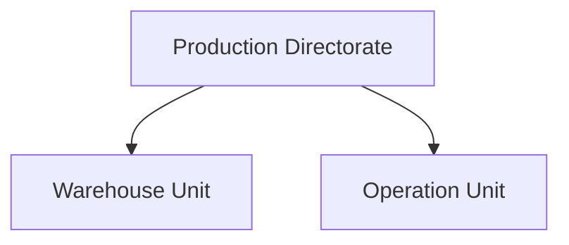
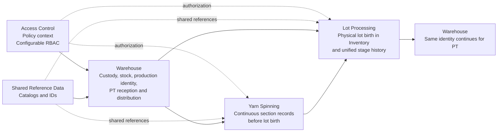
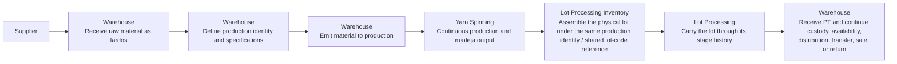

# Yarn EPR — Architecture

> Main architecture artifact for Yarn EPR.
> This document aligns the system architecture with the current PRDs and the
> boundary decisions in [Context Boundaries and Ownership](./context-boundaries-and-ownership.md).

---

## 1. System Overview

Yarn EPR is the production-management system for the **Production Directorate**
 of a textile plant.

The system exists to support two organizational units working on one shared
production flow:

- **Warehouse Unit** manages custody, stock movements, production identity
  setup, finished-product reception, and distribution readiness.
- **Operation Unit** executes production through two different business
  contexts: **Yarn Spinning** and **Lot Processing**.

The PRDs are the **source of truth** for business meaning, scope, and rules.
This architecture document translates those product decisions into a stable
context map and system-level structure. It does **not** define database schema,
endpoint contracts, or low-level backend design.

---

## 2. Organizational View vs Domain View

The architecture must keep **organizational structure** separate from
**bounded-context structure**.

### 2.1 Organizational view

At the business-organization level, the system serves the **Production
Directorate**, which contains:

- **Warehouse Unit**
- **Operation Unit**

Administration receives consolidated information, but it is not the owner of
the production flow itself.



### 2.2 Domain / bounded-context view

At the domain level, the system is **not** split into just “Warehouse” and
“Operation”.

The Operation Unit contains **two distinct bounded contexts** because they do
not share the same identity model, timeline, or record semantics:

- **Yarn Spinning** — continuous production before any physical lot exists
- **Lot Processing** — batch flow where the physical lot is born and tracked

The full bounded-context set is:

- **Warehouse**
- **Yarn Spinning**
- **Lot Processing**
- **Access Control**
- **Shared Reference Data**

This distinction is mandatory. Treating Operation as one undifferentiated model
would collapse different business meanings into one false aggregate.

---

## 3. Context Map



### Context responsibilities

| Context | Owns | Does not own |
|---|---|---|
| **Warehouse** | Raw-material reception as **fardos**, production identity definition, emissions to production, PT reception, warehouse availability/disposition, physical presentation, stock lifecycle | Spinning section records, lot-stage progression, operation quality execution |
| **Yarn Spinning** | Continuous production records by section / machine / shift / title, process quality in spinning, spinning waste, madeja output | Physical lot, lot timeline, warehouse stock |
| **Lot Processing** | Physical lot birth in Inventory, stage-by-stage lot history, stage observations, stage waste, final lot quality at delivery | Warehouse stock balances, warehouse disposition, spinning records |
| **Access Control** | Authorization policy, scopes, permissions, exceptions, auditability of permission changes | Business workflow meaning |
| **Shared Reference Data** | Shared catalogs and canonical references reused across contexts | Transactional records and workflow rules |

### Core handoffs

| From | To | Handoff |
|---|---|---|
| Warehouse | Yarn Spinning | Production identity and material availability |
| Yarn Spinning | Lot Processing | Madeja output ready for physical lot assembly |
| Warehouse | Lot Processing | Shared production identity, specifications, lot code |
| Lot Processing | Warehouse | Same production identity / shared lot-code reference with delivery condition and quality state |
| Access Control | All business contexts | Authorization decisions by action and scope |
| Shared Reference Data | All business contexts | Shared IDs, catalogs, and controlled vocabularies |

---

## 4. Architectural Principles

1. **PRDs are authoritative.** Architecture follows the PRDs and boundary
   decisions; technical design must not redefine business ownership.

2. **Boundaries follow meaning, not org-chart shortcuts.** Warehouse,
   Yarn Spinning, and Lot Processing stay separate because they own different
   identities, records, and timelines.

3. **Production identity and physical lot are different concepts.**
   Warehouse defines the production identity first; the physical lot is born
   later in Lot Processing Inventory under that same shared identity.

4. **One traceability view, multiple owners.** The system may expose a broader
   cross-context traceability view, but each context writes only its own
   segment; Lot Processing owns the stage history during operation, and
   Warehouse owns its own records.

5. **Controlled edits with audit trail.** Critical business records are not
   modeled as strict append-only. Within the operational correction window,
   edits follow scoped RBAC/policy; outside that window, only SysAdmin may
   edit. The system must preserve who changed what, when, and why.

6. **Access control is a policy context.** Authorization must stay configurable
   and separate from business responsibilities. Organizational roles do not map
   rigidly to system permissions.

7. **Shared reference data is supportive, not dominant.** Catalogs provide
   canonical values and IDs, but business rules remain in the owning contexts.

8. **Warehouse dimensions must stay explicit.** The system must distinguish:
   - operation-reported **quality state**
   - warehouse **availability / disposition**
   - **physical presentation** of finished product

---

## 5. High-Level Cross-Context Lifecycle

The production flow should be understood as a cross-context lifecycle, not as a
single internal workflow owned by one model.



### Lifecycle notes

- **Raw material starts as fardos in Warehouse**, not as a production lot.
- **Production identity is defined later** by Warehouse / Production Chief.
- **Yarn Spinning has no lot entity or lot timeline.**
- **The physical lot is born in Lot Processing Inventory.**
- **Lot Processing owns the stage history during operation.**
- **Warehouse owns its own records after PT reception**, while the system may
  still expose a broader cross-context traceability view.

---

## 6. High-Level Logical Structure

### 6.1 Naming for code-facing modules

Architecture documents may use the full descriptive context names, but code
modules, directories, package names, and shared technical identifiers should
stay short and unambiguous.

| Architecture name | Recommended code-facing name | Reason |
|---|---|---|
| **Warehouse** | `warehouse` | Short, stable, and unambiguous |
| **Yarn Spinning** | `yarn-production` | Avoids confusion with internal spinning section names |
| **Lot Processing** | `batch-processing` | Refers to the process, not just the `lot` entity |
| **Access Control** | `access` | Covers authorization and identity/access concerns without overloading `auth` |
| **Shared Reference Data** | `catalogs` | Shorter and clearer than `shared` or `refs` for code usage |

`shared` should not be used as a business context name because it tends to
become a dumping ground for unrelated concepts.

### 6.2 High-level logical structure

The repository should keep a clear separation between:

- **Business context artifacts**
- **Cross-cutting policy/support artifacts**
- **Technical delivery layers**
- **Documentation and product definitions**

At a high level, the monorepo is expected to organize around:

```text
yarn-epr/
├── docs/
│   ├── prd/
│   ├── architecture/
│   └── domain/
├── backend/ or services/
│   ├── warehouse/
│   ├── yarn-production/     # Yarn Spinning
│   ├── batch-processing/    # Lot Processing
│   ├── access/              # Access Control
│   └── catalogs/            # Shared Reference Data
├── frontend/
└── shared/ or platform/
```

This is a **logical structure**, not a final filesystem contract. The important
architectural rule is that Warehouse, Yarn Spinning, Lot Processing, Access
Control, and Shared Reference Data remain conceptually distinct.

The architecture narrative keeps the **descriptive context names**. Code-facing
module names should use the aliases defined above for directories, packages,
modules, and other technical identifiers.

---

## 7. Current Architecture Decisions

Only decisions that remain valid under the current PRDs are listed here.

| ID | Decision | Why it remains valid |
|---|---|---|
| ADR-001 | **PRDs are the source of truth for business architecture.** | Prevents technical docs from drifting away from approved product meaning. |
| ADR-002 | **Operation is modeled as two bounded contexts: Yarn Spinning and Lot Processing.** | They have different identities, timelines, records, and lifecycle responsibilities. |
| ADR-003 | **Warehouse owns production identity; Lot Processing owns physical lot birth.** | This matches the current boundary document and prevents identity/lot confusion. |
| ADR-004 | **Access Control is a configurable policy context with RBAC and scopes.** | Permissions must evolve without redesigning business workflows. |
| ADR-005 | **Business records support controlled edits with audit trail.** | Current PRDs explicitly reject strict append-only assumptions. |
| ADR-006 | **Shared Reference Data is a support context.** | Shared catalogs are needed across contexts, but they must not absorb workflow logic. |

---

## 8. Related Documents

| Document | Purpose |
|---|---|
| [Context Boundaries and Ownership](./context-boundaries-and-ownership.md) | Boundary and ownership decisions that anchor this architecture |
| [Master PRD](../prd.md) | Master PRD for the Production Directorate |
| [Access Control PRD](../prd/access-control.md) | Cross-cutting authorization policy |
| [Warehouse PRD](../prd/warehouse.md) | Warehouse business scope and rules |
| [Warehouse Records](../prd/warehouse/warehouse-records.md) | Warehouse functional record families |
| [Operation Unit PRD](../prd/operation.md) | Operation Unit contract across both production contexts |
| [Yarn Spinning PRD](../prd/operation/yarn-spinning.md) | Yarn Spinning domain rules |
| [Yarn Spinning Records](../prd/operation/yarn-spinning-records.md) | Yarn Spinning functional records |
| [Lot Processing PRD](../prd/operation/lot-processing.md) | Lot Processing domain rules |
| [Lot Processing Records](../prd/operation/lot-processing-records.md) | Lot Processing functional records |
| [Backend Architecture](./backend.md) | Technical backend design, to be aligned to this architecture |

---

## 9. What This Document Intentionally Does Not Define

This architecture document does **not** define:

- database schema
- endpoint design
- table structure
- backend class/module design
- UI screen structure

Those belong in later technical artifacts such as [Backend Architecture](./backend.md),
[Frontend Architecture](./frontend.md), and domain/design documents.
