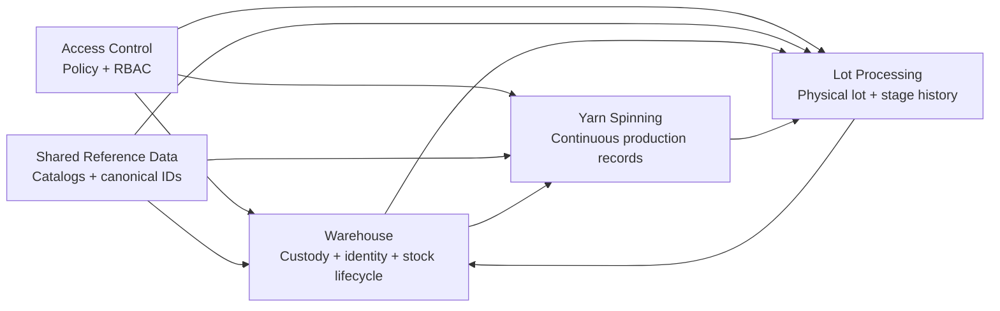
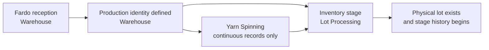
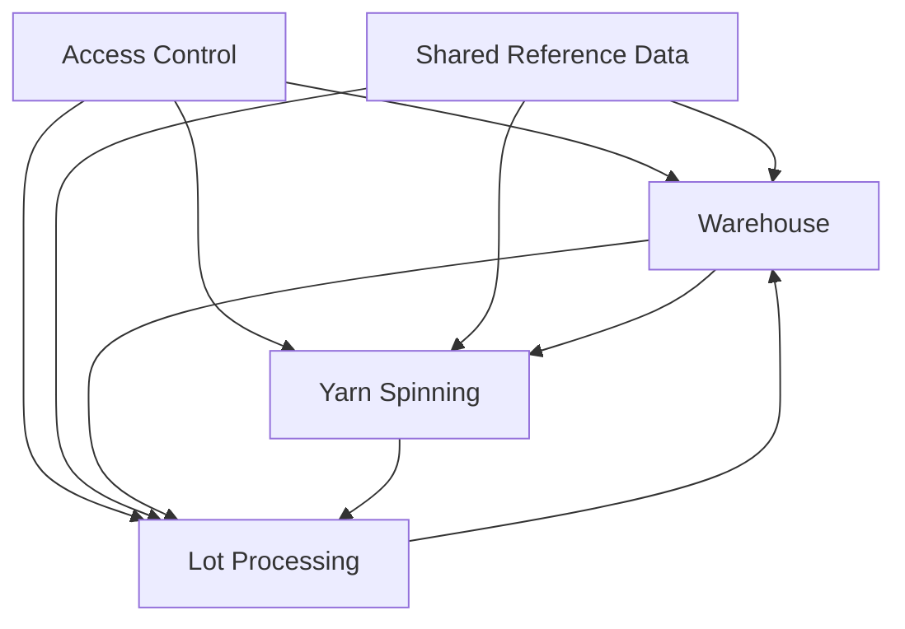

# Yarn EPR — Backend Architecture

> Backend design reference aligned with the current PRDs and the boundary decisions in
> [Architecture](./ARCHITECTURE.md) and
> [Context Boundaries and Ownership](./context-boundaries-and-ownership.md).

---

## 1. Purpose

This document translates the current product and boundary decisions into a
backend-oriented design view.

It exists to define:

- the backend contexts that should remain separate
- the kinds of aggregates and record families each context is likely to own
- the invariants and handoffs that must shape application services and ports
- the dependency direction between contexts

It does **not** define:

- database tables or SQL design
- endpoint shapes in detail
- frontend workflow behavior
- infrastructure choices beyond the contracts the backend will likely need

---

## 2. Backend design principles

1. **Boundaries follow the current domain map.** Backend modules must align with
   **Warehouse**, **Yarn Spinning**, **Lot Processing**, **Access Control**, and
   **Shared Reference Data**.
2. **Production identity and physical lot are different concepts.** Warehouse
   defines production identity; the physical lot is born later in Lot Processing
   Inventory.
3. **Yarn Spinning and Lot Processing must stay separate.** They do not share
   the same aggregate root, timeline, or record semantics.
4. **Business records support controlled edits with audit trail.** The backend
   must not assume strict append-only behavior for critical business records;
   within the operational correction window, edits follow scoped RBAC/policy,
   and outside that window only SysAdmin may edit.
5. **Recorder assignment is policy-driven.** The domain must not hard-code
   Supervisor as the default recorder.
6. **Warehouse state dimensions stay separate.** Quality state,
   availability/disposition, and physical presentation are different concerns.
7. **Access Control is a policy context.** It authorizes actions and scopes; it
   does not own business workflow meaning.

---

## 3. Suggested per-context internal structure

Each backend context can follow the same logical shape:

```text
<context>/
├── domain/          # aggregates, value objects, domain services, invariants
├── application/     # use cases / commands / queries / orchestration
├── ports/           # repository, policy, external read-model, integration contracts
└── adapters/        # persistence, HTTP, messaging, auth, external integrations
```

This is a **logical structure**, not a final filesystem contract. The important
rule is conceptual isolation between contexts.

Code-facing names should follow the aliases defined in
[Architecture](./ARCHITECTURE.md).

---

## 4. Context map for the backend



---

## 5. Context: Warehouse

### Purpose

Own custody, stock movements, production identity definition, finished-product
reception, and downstream warehouse lifecycle decisions.

### Core aggregates / record families

- **Raw Material Reception** — receipt of raw material as **fardos**
- **Production Identity Definition** — documentary/commercial identity later
  reused across contexts
- **Material Emission to Production** — stock movement and production handoff
- **Finished Product Reception** — warehouse re-entry under the same identity
- **PT Operational Classification** — warehouse availability/disposition and
  handling decisions
- **PT Exit / Return Records** — sale, transfer, return, and similar warehouse
  lifecycle records
- **Supply Movement Records** — non-lot warehouse inventory for production inputs

### Important invariants / business rules

- Raw material is received as **fardos**, not as a production lot.
- Production identity is defined **after** fardo reception as a separate business
  act.
- Warehouse owns the production identity, but **does not** own the physical lot
  birth.
- Finished-product reception continues the same production identity / shared
  lot-code reference without collapsing Warehouse ownership into Lot Processing
  history.
- Warehouse must keep these dimensions separate:
  - quality state reported by Operation
  - warehouse availability/disposition
  - physical presentation / storage form
- Warehouse can document inconsistencies during PT reception; that is not the
  same as rewriting Operation history.
- Critical warehouse records support controlled edits with full audit trail.

### Likely ports / contracts

- `WarehouseRecordRepository`
- `ProductionIdentityRepository`
- `StockBalanceReadPort`
- `WarehouseAuthorizationPolicyPort`
- `LotProcessingDeliveryReadPort`
- `AuditTrailWriterPort`
- `PeriodClosurePolicyPort`

### Consumes from other contexts

- **Access Control**: action + scope authorization
- **Shared Reference Data**: employees, shifts, yarn titles, movement types,
  units, destinations, suppliers
- **Lot Processing**: delivery condition, lot quality state, delivery history,
  delivered quantities/presentation references
- **Yarn Spinning**: no direct ownership dependency; usually only indirect
  planning/reference effects through Warehouse identity and Lot Processing output

---

## 6. Context: Yarn Spinning

### Purpose

Own continuous production records before any physical lot exists.

### Core aggregates / record families

- **Production Discharge Records** by machine / shift / title
- **Advance / Progress Records** for sections that summarize input-output flow
- **Process Quality Records** for section/machine quality control
- **Spinning Waste Records** by machine group / section
- **Madeja Output Availability** as the business output that feeds lot assembly

### Important invariants / business rules

- Yarn Spinning has **no lot aggregate** and **no lot timeline**.
- Its continuity is organized by section, machine, shift, business date, and
  yarn title — not by physical lot history.
- The backend must model Madejeras output as availability for later assembly,
  not as the birth of the physical lot.
- Net weights and derived production values should be computed/validated by
  domain rules rather than treated as arbitrary user-entered facts.
- Waste and quality belong to the spinning context even if recorder assignment is
  configurable by policy.
- Supervisor is a supervisory actor, not the default recorder in the domain
  model.
- Critical operational records support controlled edits with audit trail and
  policy-based correction windows.

### Likely ports / contracts

- `ProductionRecordRepository`
- `AdvanceRecordRepository`
- `ProcessQualityRepository`
- `WasteRecordRepository`
- `MadejaAvailabilityReadModelPort`
- `YarnSpinningAuthorizationPolicyPort`
- `AuditTrailWriterPort`

### Consumes from other contexts

- **Access Control**: who may register, validate, approve, or correct records
- **Shared Reference Data**: machines, machine groups, sections, shifts,
  employees, yarn titles
- **Warehouse**: production identity, title/color/client/specification context,
  and material availability references

---

## 7. Context: Lot Processing

### Purpose

Own the physical lot from Inventory assembly through the stage history during
operation until delivery back to Warehouse.

### Core aggregates / record families

- **Physical Lot** — born in Inventory under a Warehouse-defined production identity
- **Lot Stage Record** — the main record family for Inventory, Dyeing, Drying,
  Winding/Ovilling, Bagging, and Quality
- **Stage Observation / Inconvenience Records**
- **Stage Waste Records**
- **Delivery-to-Warehouse Record** with lot condition and handoff metadata

### Important invariants / business rules

- The physical lot is born in **Inventory**, not in Warehouse and not in Yarn
  Spinning.
- The lot reuses the Warehouse production identity / shared lot-code reference,
  but Lot Processing owns the physical batch lifecycle.
- Lot Processing stage records should follow the **single-stage-record model**:
  - inherited data from Warehouse or the previous stage
  - locally verified data
  - stage-generated data
  - observations, waste, and output condition
- The lot history is sequential by stage, but stage records are not separate
  delivery/receipt document pairs unless later design proves that necessary.
- No lot history should be flattened into generic “Operation” records.
- Quality documents the lot condition for delivery; Warehouse later decides its
  own operational disposition.
- Critical stage records support controlled edits with audit trail; within the
  operational correction window, edits follow scoped RBAC/policy, and outside
  that window only SysAdmin may edit.

### Likely ports / contracts

- `PhysicalLotRepository`
- `LotStageRecordRepository`
- `LotStageSequencePolicyPort`
- `MadejaAvailabilityPort`
- `WarehouseIdentityReadPort`
- `LotProcessingAuthorizationPolicyPort`
- `AuditTrailWriterPort`
- `WarehouseDeliveryPort`

### Consumes from other contexts

- **Access Control**: stage-level authorization and correction permissions
- **Shared Reference Data**: employees, shifts, stages, machines/equipment,
  defect catalogs, controlled vocabularies
- **Warehouse**: production identity, lot code, title, color, client/destination,
  and order specifications
- **Yarn Spinning**: madeja output availability and readiness for lot assembly

---

## 8. Context: Access Control

### Purpose

Own configurable RBAC policy, scopes, permission assignments, and permission
auditability across the system.

### Core aggregates / record families

- **System Role / Capability Definition**
- **Permission Assignment**
- **Scope Definition**
- **Assignment Exception / Override**
- **Permission Change Audit Record**

### Important invariants / business rules

- Access Control is a **policy context**, not a workflow owner.
- It may answer who can register, validate, approve, correct, or administer in a
  scope; it must not redefine the business meaning of those actions.
- Organizational roles and system permissions are related but not equivalent.
- Recorder/validator/approver assignments must remain configurable.
- Exceptions must be explicit and auditable.

### Likely ports / contracts

- `AuthorizationDecisionPort`
- `PermissionAssignmentRepository`
- `ScopeRepository`
- `PermissionAuditRepository`
- `UserRoleMappingReadPort`

### Consumes from other contexts

- **Shared Reference Data**: canonical user/employee identities and relevant
  organizational references
- **Business contexts**: action names, protected resources, and scopes that need
  authorization

---

## 9. Context: Shared Reference Data

### Purpose

Provide canonical catalogs and stable reference identities reused by multiple
contexts.

### Core aggregates / record families

- **Employee / User Reference**
- **Machine / Machine Group**
- **Section / Stage / Shift**
- **Yarn Title / Count**
- **Movement Type / Unit / Catalog Value**
- **Other controlled vocabularies shared across contexts**

### Important invariants / business rules

- Shared Reference Data owns canonical values and IDs, not transactional meaning.
- It must not absorb warehouse rules, lot rules, or permission logic.
- Changes to reference data should remain auditable because they affect multiple
  contexts.

### Likely ports / contracts

- `CatalogQueryPort`
- `ReferenceValidationPort`
- `CatalogMaintenanceRepository`
- `ReferenceChangeAuditPort`

### Consumes from other contexts

- Governance decisions about which catalogs exist and how they are curated

---

## 10. Identity vs physical lot

The backend must model these as separate concepts.

| Concept | Owner | Backend meaning |
|---|---|---|
| **Production identity** | **Warehouse** | Cross-context reference defined after fardo reception and before later production execution |
| **Physical lot** | **Lot Processing** | Real batch assembled in Inventory from madejas and tracked through the stage history |

### Design consequence

- Warehouse should expose identity data for downstream use.
- Lot Processing should instantiate the physical lot under that identity.
- Yarn Spinning should reference the upstream production context when needed, but
  it should not pretend to own or progress a lot aggregate.



---

## 11. Controlled edits and audit trail

The backend should adopt a consistent correction model across contexts.

### Required behavior

- Critical business records are **not deleted silently**.
- Allowed corrections update business truth while preserving historical
  traceability.
- Within the operational correction window, edits follow scoped RBAC/policy.
- Outside that window, only SysAdmin may edit.
- The audit trail should preserve at least:
  - who changed the record
  - when it changed
  - previous values
  - new values
  - reason for correction
  - applicable authorization context

### Architecture consequence

Each business context should own:

- its own correction rules
- its own editable time-window policy when applicable
- its own audit emission or audit persistence contract

The system should therefore avoid a blanket append-only assumption in backend
design and avoid burying correction semantics inside infrastructure only.

The system may expose a broader cross-context traceability view, but that must
not collapse ownership: Lot Processing owns stage history during operation, and
Warehouse owns its own records.

---

## 12. Dependency direction and context interaction

### High-level rule

Supporting contexts point inward; business contexts depend on policy and
reference services, while peer business handoffs happen only through explicit
contracts.



### Interaction summary

| From | To | Why |
|---|---|---|
| Access Control | All business contexts | authorization decisions by action and scope |
| Shared Reference Data | All business contexts | canonical IDs, catalogs, and validations |
| Warehouse | Yarn Spinning | production identity and material context |
| Warehouse | Lot Processing | production identity, specifications, and shared lot-code reference |
| Yarn Spinning | Lot Processing | madeja output availability for physical lot assembly |
| Lot Processing | Warehouse | processed lot delivery, quality state, and handoff condition |

### Architectural constraint

No context should write directly into another context's internal record model.
Cross-context collaboration should happen through ports, published views, or
integration contracts that preserve ownership.

---

## 13. Related documents

- [Architecture](./ARCHITECTURE.md)
- [Context Boundaries and Ownership](./context-boundaries-and-ownership.md)
- [Master PRD](../prd.md)
- [Access Control PRD](../prd/access-control.md)
- [Operation PRD](../prd/operation.md)
- [Yarn Spinning PRD](../prd/operation/yarn-spinning.md)
- [Yarn Spinning Records](../prd/operation/yarn-spinning-records.md)
- [Lot Processing PRD](../prd/operation/lot-processing.md)
- [Lot Processing Records](../prd/operation/lot-processing-records.md)
- [Warehouse PRD](../prd/warehouse.md)
- [Warehouse Records](../prd/warehouse/warehouse-records.md)
