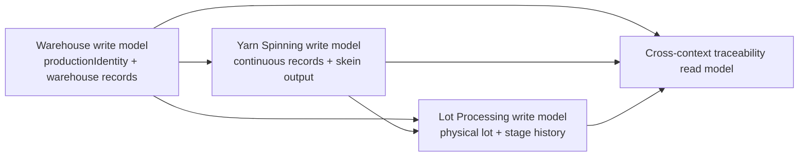

# Yarn EPR — Persistence Design Principles

> Conceptual backend persistence baseline.
> This document translates stable PRD and architecture decisions into persistence rules without defining schema.

---

## 1. Purpose and scope

This document defines the conceptual persistence baseline for Yarn EPR.

It keeps persistence design aligned with:

- bounded-context ownership
- the ubiquitous language naming contract
- controlled correction with audit trail
- the separation between operational business time and system time

It is intentionally **conceptual**. It does **not** define tables, columns, foreign keys, or SQL patterns.

---

## 2. Core persistence principles

1. **Persistence follows bounded-context ownership.** A context writes only the record families whose business meaning it owns.
2. **Write models and traceability views stay separate.** Cross-context visibility is allowed; cross-context write-model flattening is not.
3. **Production identity and physical lot stay distinct.** They may share references, but they are not the same persisted concept.
4. **Yarn Spinning persists continuous records, not lot history.** No lot aggregate or lot timeline should be fabricated upstream.
5. **Lot Processing persists the physical lot lifecycle during operation.** Its stage history is the operational source of truth once the lot is assembled.
6. **Warehouse dimensions stay explicit.** Quality state, warehouse availability/disposition, and physical presentation must not collapse into one field family.
7. **Business truth is editable under policy, not append-only by default.** Persist corrected current state plus auditable change history.
8. **Business date, shift, and system timestamps are different data.** Persist them separately where the record meaning requires it.
9. **Names follow the ubiquitous language contract.** Persistence names should use canonical terms such as `productionIdentity`, `lot`, `yarnCount`, `stock`, and `physicalPresentation`.

---

## 3. Write-model ownership by context

| Context | Owns the write model for | Persistence consequence |
|---|---|---|
| **Warehouse** | bale reception, production identity, material emission, finished-product reception, stock lifecycle, warehouse classification/disposition | Warehouse persists identity and warehouse records before and after operation, but not production-stage history |
| **Yarn Spinning** | production discharges, progress, process quality, spinning waste, skein output availability | Persist by section/machine/shift/business date/yarn count, not by lot timeline |
| **Lot Processing** | physical lot birth, stage records, stage notes/exceptions, stage waste, quality-at-delivery to Warehouse | Persist the lot aggregate and ordered stage history as the operational write model |
| **Access Control** | permissions, scopes, exceptions, authorization history | Keep authorization persistence separate from business records |
| **Shared Reference Data** | catalogs and canonical shared identifiers | Persist reusable references only, not workflow history |

### Ownership rule

If a context needs another context's data to work, it should persist a **reference or snapshot for its own use**, not take ownership of the upstream write model.

---

## 4. Read-model and reporting principles

- A **cross-context traceability view** may unify Warehouse, Yarn Spinning, and Lot Processing for navigation and reporting.
- That view must be treated as a **read model**, not as the place where ownership is redefined.
- Read models may denormalize data for query clarity, audit review, or supervisor reporting.
- Read models must remain **rebuildable from owning records**.
- Read models must make source ownership visible when combining segments of the lifecycle.

### Practical rule

Use cross-context reporting models for:

- end-to-end traceability
- supervisor and management summaries
- stock + operation reconciliation
- operational dashboards

Do **not** use them as the canonical write target for corrections or workflow transitions.

---

## 5. Identity and reference rules

### 5.1 `productionIdentity` vs `lot`

| Concept | Owner | Meaning | Persistence rule |
|---|---|---|---|
| **production identity** | Warehouse | Cross-context business identity defined before physical lot assembly | Persist as a Warehouse-owned concept that downstream contexts reference |
| **lot** | Lot Processing | Physical batch assembled later from skeins | Persist only when the Inventory stage creates the physical lot |

Rules:

- Do not use `lot` as a shortcut for upstream Warehouse identity.
- Do not force Yarn Spinning records to attach to a lot that does not exist there.
- A shared lot code may travel across contexts, but it does not erase ownership differences.

### 5.2 Cross-context references

- Prefer **stable IDs / codes** for cross-context references.
- Use references to connect lifecycle segments across contexts.
- Keep reference direction explicit: downstream contexts consume upstream identity; upstream contexts do not own downstream stage history.

### 5.3 IDs vs denormalized snapshots

Use **IDs/references** when:

- the source data remains authoritative elsewhere
- the consuming context only needs linkage or validation
- the current value must stay synchronized to the source of truth

Use **denormalized snapshots** when:

- a record must preserve what was known at the time of registration
- later upstream edits must not silently rewrite historical business meaning
- the data is needed for audit readability or operational evidence

Typical examples of snapshot-worthy data include business-facing descriptors such as yarn count, color requirement, client/destination, or physical delivery condition when those values formed part of the decision at registration time.

---

## 6. Correction and audit persistence principles

- Critical business records support **controlled edits**, not silent overwrite and not mandatory append-only replacement records.
- The persisted model should distinguish:
  - **current business state**
  - **audit history of corrections**
- Within the operational correction window, edits are governed by policy/RBAC.
- Outside that window, only **SysAdmin** may edit.
- Audit persistence should capture at least:
  - record identity
  - changed fields or before/after values
  - reason for correction
  - actor identity
  - authorization scope or policy basis when relevant
  - system timestamp of the change

### Design consequence

Audit history is cross-cutting, but the **business correction rule belongs to the owning context**.

---

## 7. Time modeling principles

Where the PRDs distinguish operational time from system-capture time, persistence should keep them separate.

| Time concept | Meaning | Persistence principle |
|---|---|---|
| **business date** | When the operation or movement belongs in plant/business terms | Store as business data, not as a derived view of system insertion time |
| **shift** | Operational work period selected by the user or process context | Store explicitly when records are shift-based |
| **system timestamp** | When the system captured or changed the record | Store automatically for creation/audit history |

Rules:

- Do not infer business date from `created_at`.
- Do not collapse shift into a free-text note when shift affects reporting or correction policy.
- Preserve multiple timestamps when needed: record creation, last correction, and domain event timing.

---

## 8. Suggested persistence families by context

These are **conceptual families**, not tables.

| Context | Suggested persistence families |
|---|---|
| **Warehouse** | bale reception, production identity, material emission, finished-product reception, warehouse stock movement, warehouse stock balance/closure, PT availability/disposition history, PT physical presentation history, supply movement, warehouse correction audit |
| **Yarn Spinning** | production discharge, progress, process quality, spinning waste, skein availability/publication, spinning correction audit |
| **Lot Processing** | physical lot, lot stage record, stage note/exception, stage waste, quality-stage outcome, delivery-to-Warehouse handoff, lot correction audit |
| **Access Control** | role/capability assignment, scope definition, exception/override, authorization decision history, permission-change audit |
| **Shared Reference Data** | employee/user reference, machine/machine-group, section/stage/shift catalog, yarn count catalog, shared controlled vocabulary, reference-change audit |

---

## 9. Optional conceptual view

---

## 10. Out of scope

This document does **not** define:

- tables, columns, or foreign keys
- SQLAlchemy model structure
- migration order
- partitioning/index strategy
- exact audit storage shape
- exact read-model projection mechanism
- final identifier formats
- closure/immutability mechanics for each record family
- concrete schema for stock balances, snapshots, or stage sequencing

## 11. Related decision artifact

- [Persistence Decisions](./persistence-decisions.md)
