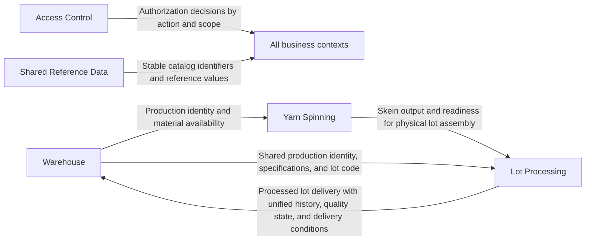

# Yarn EPR — Context Boundaries and Ownership

> Pre-architecture artifact.
> This document defines domain boundaries and ownership decisions that must be stable before [Architecture](./ARCHITECTURE.md) is rewritten.

---

## 1. Purpose

This document exists to lock the **business boundaries**, **ownership rules**, and
**handoff language** before deeper architecture work starts.

It is intentionally **pre-technical**:

- it defines **who owns what meaning**
- it defines **where a concept starts and stops**
- it prevents [Architecture](./ARCHITECTURE.md) from mixing contexts, records, and responsibilities

It does **not** define database schema, APIs, or internal code structure.

---

## 2. Recommended bounded contexts

| Context | Why it exists | Core boundary |
|---|---|---|
| **Warehouse** | Owns warehouse custody, stock movements, production identity setup, and finished-product handling | Stops at warehouse-issued identity and warehouse-managed stock lifecycle |
| **Yarn Spinning** | Owns continuous spinning production records before any physical lot exists | Stops at skein output and section/shift/machine records |
| **Lot Processing** | Owns the physical lot lifecycle after the Inventory stage assembles it | Stops when the processed lot is delivered back to Warehouse |
| **Access Control** | Owns authorization policy, scopes, and configurable permissions | Does not own business workflow semantics |
| **Shared Reference Data** | Owns shared catalogs and canonical reference values used by multiple contexts | Does not own operational records |

**Recommendation:** treat **Yarn Spinning** and **Lot Processing** as separate contexts inside the broader **Operation Unit**, not one generic “Operation” model. They have different identities, timelines, and record semantics.

---

## 3. Context definitions

### 3.1 Warehouse

- **Core responsibility:** manage physical custody and documentary control of raw material, finished product, and production supplies; define the production identity that later travels across contexts.
- **Owns:** raw-material reception as **bales**; production identity definition; emission to production; finished-product reception; warehouse availability/disposition; physical presentation; stock movements; stock balances; supply movements.
- **Does not own:** spinning production records; lot-stage progression; process quality execution; lot-stage waste; final production-stage decisions inside Operation.
- **Inbound dependencies:** Access Control; Shared Reference Data; processed lot delivery and quality documentation from Lot Processing.
- **Outbound contracts / shared identifiers:** production identity / lot code; yarn count; color requirement; client/destination; emitted quantity references; finished-product receipt reference.

### 3.2 Yarn Spinning

- **Core responsibility:** record continuous yarn production before a physical lot exists.
- **Owns:** production discharges; section progress records; process quality in spinning sections; spinning waste; skein output from Madejeras (Skeining).
- **Does not own:** warehouse stock; production identity assignment rules; physical lot assembly; lot timeline; final finished-product reception.
- **Inbound dependencies:** Access Control; Shared Reference Data; warehouse-issued production identity as external planning/reference context.
- **Outbound contracts / shared identifiers:** yarn count produced; skein availability; section/shift/machine production records; operational readiness for lot assembly.

### 3.3 Lot Processing

- **Core responsibility:** own the physical lot once the Inventory stage assembles it and carry its unified stage history until delivery back to Warehouse.
- **Owns:** physical lot birth; lot stage records; lot timeline; lot-stage notes/exceptions; stage waste; final quality documentation for delivery; handoff back to Warehouse.
- **Does not own:** warehouse stock balances; warehouse availability/disposition; spinning-section records; permission policy; reference catalog governance.
- **Inbound dependencies:** warehouse-issued production identity and specifications; skein output from Yarn Spinning; Access Control; Shared Reference Data.
- **Outbound contracts / shared identifiers:** same production identity / lot code; lot history; lot quality state at delivery; delivery conditions; delivered quantity/physical presentation.

### 3.4 Access Control

- **Core responsibility:** govern who may read, register, validate, approve, correct, or administer data in each scope.
- **Owns:** roles, permissions, scopes, exceptions, and auditability of permission changes.
- **Does not own:** who is operationally responsible in the business sense; record semantics; workflow state; domain invariants.
- **Inbound dependencies:** organizational actors and scopes defined by business contexts.
- **Outbound contracts / shared identifiers:** permission assignments by action + scope; authorization decisions; auditable permission history.

### 3.5 Shared Reference Data

- **Core responsibility:** provide canonical reference values reused across contexts.
- **Owns:** employees, machines, machine groups, sections, shifts, yarn counts, movement-type catalogs, and similar shared lookups.
- **Does not own:** transactional records, lot timelines, stock balances, or permission decisions.
- **Inbound dependencies:** business governance that decides which catalogs exist.
- **Outbound contracts / shared identifiers:** stable IDs and controlled vocabularies reused by Warehouse, Yarn Spinning, Lot Processing, and Access Control.

---

## 4. Explicit boundary decisions

### 4.1 Production identity vs physical lot

These are **not the same thing**.

| Concept | Owner | Meaning |
|---|---|---|
| **Production identity** | **Warehouse** | Documentary/commercial-production identity defined before processing: yarn count, color, client, requirements, and shared code |
| **Physical lot** | **Lot Processing** | The real grouped set of skeins assembled in the Inventory stage and then moved through batch stages |

**Decision:** the same shared identifier may travel across contexts, but the **physical lot is born later** in Lot Processing. Warehouse defines identity first; Lot Processing instantiates the physical batch under that identity.

### 4.2 Warehouse vs Yarn Spinning vs Lot Processing

- **Warehouse** receives **bales**, not physical production lots.
- **Yarn Spinning** transforms material continuously and does **not** own a lot entity or lot timeline.
- **Lot Processing** starts when the Inventory stage assembles skeins into a physical lot and from then on owns the lot timeline.
- The lot history delivered back to Warehouse is a **continuation**, not a new warehouse-only record detached from production.

### 4.3 Access Control as a policy context

Access Control must stay a **policy context**, not a hidden business owner.

- It may decide **who can record** a stage.
- It must **not redefine what the stage is**.
- It may change recorder/validator/approver assignments.
- It must **not freeze today’s job-role mapping into the domain model**.

### 4.4 Shared Reference Data

Shared Reference Data is a support context, not a dumping ground for business logic.

- keep canonical lists and identifiers here
- keep operational meaning in the owning business context
- do not move lot rules, stock rules, or permission rules into catalogs

---

## 5. Aggregate / record ownership

| Aggregate / record family | Owning context | Ownership note |
|---|---|---|
| Raw material reception (`bales`) | Warehouse | Initial physical receipt of MP |
| Production identity definition | Warehouse | Defined before physical lot assembly |
| MP emission to production | Warehouse | Stock movement plus production handoff |
| Warehouse supply movement | Warehouse | Independent from production lot history |
| Spinning production discharge | Yarn Spinning | Machine/shift/yarn-count record |
| Spinning progress | Yarn Spinning | Section summary, not lot history |
| Spinning process quality | Yarn Spinning | Section/machine quality, not lot-final quality |
| Spinning waste | Yarn Spinning | Continuous-process waste |
| Skein output availability | Yarn Spinning | Output contract for lot assembly |
| Physical lot aggregate | Lot Processing | Born in Inventory stage |
| Lot stage record | Lot Processing | Unified lot history across stages |
| Lot-stage note / inconvenience | Lot Processing | Attached to stage history |
| Lot-stage waste | Lot Processing | Part of lot history |
| Final lot quality state at delivery | Lot Processing | Documents delivery condition to Warehouse |
| PT reception from Operation | Warehouse | Warehouse receives under existing identity |
| PT availability / disposition | Warehouse | Separate from production quality state |
| PT physical presentation | Warehouse | Separate dimension from quality/disposition |
| PT sale / transfer / return | Warehouse | Warehouse stock lifecycle after reception |
| Permission policy and scope rules | Access Control | Cross-cutting authorization only |
| Employees, machines, shifts, yarn counts, sections | Shared Reference Data | Canonical references only |

---

## 6. Cross-context handoff summary

| From | To | Handoff |
|---|---|---|
| Warehouse | Yarn Spinning | Production identity and material availability for execution |
| Yarn Spinning | Lot Processing | Skein output and readiness for physical lot assembly |
| Warehouse | Lot Processing | Shared production identity, specifications, and lot code |
| Lot Processing | Warehouse | Processed lot delivery with unified history, quality state, and delivery conditions |
| Access Control | All business contexts | Authorization decisions by action and scope |
| Shared Reference Data | All business contexts | Stable catalog identifiers and reference values |

**Important:** no handoff changes ownership retroactively. A receiving context may reference prior data, but it must only write its own part.

---

## 7. Top architecture mistakes to avoid

1. **Modeling Warehouse reception of bales as if the physical lot already exists.**
2. **Treating Yarn Spinning and Lot Processing as one aggregate model with one timeline.**
3. **Letting Warehouse own production-stage records after the lot returns.**
4. **Using Supervisor as the default recorder in the domain model.** Supervisor is the operational lead/consolidator, not the mandatory registrar.
5. **Hard-coding current job roles into authorization rules.** RBAC must stay configurable.
6. **Collapsing quality state, warehouse availability/disposition, and physical presentation into one status field.**
7. **Designing for strict append-only when the PRD requires controlled edits with audit trail.**
8. **Using Shared Reference Data as a home for business workflow rules.**
9. **Turning this boundary document into schema or API design too early.**

---
