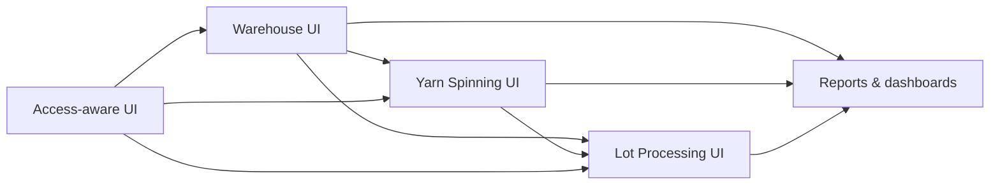

# Yarn EPR — Frontend Architecture

> Frontend architecture reference aligned with the current PRDs, the main
> [Architecture](./ARCHITECTURE.md), the
> [Backend Architecture](./backend.md), and
> [Context Boundaries and Ownership](./context-boundaries-and-ownership.md).

---

## 1. Purpose and frontend responsibility

The frontend exists to let Warehouse, Yarn Spinning, Lot Processing, leadership,
and support users work with the system through task-oriented screens, guided
data entry, traceability views, and consolidated reporting.

The frontend is a **client of backend APIs**, not an owner of domain meaning.
It must not decide:

- whether a user is allowed to register, validate, approve, or correct data
- whether a lot/stage transition is valid
- whether a warehouse movement is acceptable
- whether a correction is still within the allowed policy window
- whether a derived production value is authoritative

The frontend may provide **presentation logic** for speed and usability:

- inline totals and previews
- spreadsheet-style formulas for operator feedback
- local validation for completeness and formatting
- warning banners when backend responses indicate conflicts or policy limits

Backend decisions always remain authoritative.

---

## 2. UI principles aligned with the domain model

1. **Mirror bounded contexts where meaning changes.** The Production
   Directorate has two organizational units, but the frontend must separate
   **Warehouse**, **Yarn Spinning**, and **Lot Processing** in navigation,
   forms, and read models when their business concepts differ.

2. **Do not collapse identity and lot.** Warehouse receives raw material as
   **bales** first. Production identity is defined later. The frontend must not
   present MP reception as “generate lot code” or imply that the physical lot
   already exists at reception time.

3. **Do not force a lot mental model into Yarn Spinning.** Yarn Spinning is
   organized around **section, machine, shift, business date, and yarn count**. Its
   UI should prioritize those slices, not a fake lot timeline.

4. **Treat Lot Processing as a unified stage-history flow.** The main UI model
   is the **single-stage-record** pattern, not a primary split between “enter”
   and “exit” pages.

5. **Support controlled correction, not silent rewriting.** Editing UX must make
   audit implications visible and must respect backend policy decisions.

6. **Keep role assumptions out of screen logic.** Supervisor is an operational
   lead and consolidator, not the default recorder. Recorder/validator/approver
   assignment must come from configurable authorization, not hardcoded UI rules.

7. **Keep warehouse state dimensions explicit.** Quality state,
   warehouse availability/disposition, and physical presentation must appear as
   separate concepts in UI labels, filters, and detail panels.

---

## 3. High-level frontend structure

The frontend should be organized by bounded context plus shared platform layers.

```text
frontend/
└── src/
    ├── app/                    # app shell, providers, router bootstrap
    ├── routes/                 # route definitions and guards
    ├── auth/                   # session/authn wiring only
    ├── api/                    # HTTP client and context-specific API modules
    ├── features/
    │   ├── warehouse/
    │   ├── yarn-production/    # code-facing alias for Yarn Spinning
    │   ├── batch-processing/   # code-facing alias for Lot Processing
    │   ├── access/
    │   └── reports/
    ├── components/
    │   ├── ui/                 # reusable primitives
    │   ├── grid/               # spreadsheet-like entry components
    │   ├── layout/
    │   └── feedback/
    ├── hooks/
    └── shared/
        ├── types/
        ├── formatting/
        └── utils/
```

### Structure rules

- Use **descriptive context names** in architecture narratives.
- Use code-facing aliases only for module/directory naming when needed:
  - `warehouse`
  - `yarn-production`
  - `batch-processing`
  - `access`
- Treat `catalogs` as a shared/platform/admin support area for shared reference
  data, not as a primary business feature area.
- Keep shared UI primitives generic; keep business screens and queries inside
  the owning feature area.
- Do not create one generic `operation` feature that hides the distinction
  between Yarn Spinning and Lot Processing.

---

## 4. Feature areas and page families



### 4.1 Warehouse

Main page families should include:

- **Raw material reception** for bales and inbound custody records
- **Production identity definition** as a separate workflow after reception
- **Emission to production** with references to upstream identity and stock
- **Finished-product reception** from Lot Processing under the same production
  identity / shared lot-code reference
- **PT classification/disposition** with separate fields for:
  - quality state reported by Operation
  - warehouse availability/disposition
  - physical presentation
- **PT exits and returns**
- **Supplies / production inputs**
- **Warehouse history and stock views**

The Warehouse UX must never imply that MP reception itself creates the physical
lot.

### 4.2 Yarn Spinning

Main page families should include:

- **Section dashboards** by shift/date/yarn count
- **Production discharge entry** by machine and yarn count
- **Progress entry** only for sections that actually use it
- **Process quality entry** by section/machine with section-specific patterns
- **Waste entry** by machine group / section
- **Shift consolidations** for supervisory review
- **Skein output availability views** for downstream lot assembly readiness

Yarn Spinning screens should be optimized for continuous-process capture, not
for lot tracking. Avoid lot-centric route names, labels, or breadcrumbs here.

### 4.3 Lot Processing

Main page families should include:

- **Lot queue / worklist** by current stage and readiness
- **Lot detail / unified history**
- **Stage record entry/edit** for Inventory stage, Dyeing, Drying,
  Winding, Ball Winding, Bagging, and Quality stage
- **Stage note and inconvenience capture** inside the relevant stage record
- **Stage waste capture** inside or adjacent to the stage record
- **Delivery-to-Warehouse summary** driven by the final Quality stage/hand-off record

The primary abstraction is **one record per stage in the shared lot history**.
If sub-steps are needed in the UI, they should still resolve into one stage
record instead of separate architectural “enter stage” and “exit stage” page
families.

### 4.4 Reports and cross-context views

Cross-context reporting may combine data from multiple contexts, but it must not
erase ownership boundaries. Typical page families include:

- Production Chief consolidated daily view
- Production vs plan by yarn count/period
- Warehouse stock and PT lifecycle views
- Lot history read views across Warehouse and Lot Processing segments
- Operational summaries by shift, section, or stage

These views may present broader cross-context traceability, but they must not
collapse ownership: Lot Processing owns the stage history during operation, and
Warehouse owns its own records.

---

## 5. Forms and spreadsheet-style data entry

The UI should support two complementary input styles.

### 5.1 Spreadsheet-like capture

Use spreadsheet-style capture where operators close a shift/session with many
rows of structured data, especially in Yarn Spinning:

- production discharges
- section progress
- repetitive process-quality records
- grouped waste records

Recommended behavior:

- keyboard-first navigation
- paste from existing spreadsheets
- row-level validation and completion hints
- inline totals/previews
- clear separation between user-entered values and system-calculated previews

### 5.2 Guided record forms

Use guided forms when the business object is richer and sequential, especially
in Warehouse and Lot Processing:

- warehouse receptions, emissions, PT classification, exits, returns
- lot stage records with inherited, verified, and locally generated data
- correction flows that require reason capture and audit awareness

### 5.3 Form design rule

The UI should distinguish, when relevant:

- **inherited/reference data** from another context or previous stage
- **locally verified data** the current user confirms
- **new business data** produced in the current action
- **system timestamps / audit metadata** captured automatically

That distinction is especially important for Lot Processing stage records.

---

## 6. Auth and access integration

The frontend must integrate with authentication and authorization as separate concerns.

### 6.1 Authentication

- authenticate the user
- store and refresh session credentials/tokens
- protect private routes
- recover cleanly from 401/session expiration

### 6.2 Authorization

Authorization is driven by configurable RBAC and scopes from the backend.
Frontend behavior should therefore be based on **capabilities and server
responses**, not on hardcoded organizational roles.

The UI may:

- request capability/readiness metadata for screens and actions
- hide or disable unavailable actions when authorization is known in advance
- show backend-denied actions as disabled or rejected with explanation

The UI must not assume, for example, that:

- Supervisor always records production
- Quality is always the only editor of a given screen
- Warehouse chief always authorizes a given action

Those are policy assignments, not fixed frontend truths.

---

## 7. State management and API client guidance

### 7.1 Server state first

Business data should be treated primarily as **server state**:

- fetch by context-specific API modules
- cache/query by resource identity and filters
- invalidate or refresh after successful mutations
- avoid duplicating authoritative business records in ad hoc global stores

### 7.2 Local UI state

Keep local state for:

- form drafts
- grid edits before submit
- filters, sorting, expanded panels
- temporary compare/review interactions

Promote to shared state only when multiple routes or shells truly need the same
UI concern.

### 7.3 API module boundaries

Keep frontend API modules aligned to backend context boundaries:

- `api/warehouse`
- `api/yarn-production`
- `api/batch-processing`
- `api/access`
- `api/catalogs` when shared reference data is exposed separately

Do not build one oversized `api/operation` module that hides distinct contracts.

### 7.4 Error handling

The client should consistently surface:

- validation errors for incomplete or malformed input
- authorization failures
- concurrency/conflict responses
- network/offline states
- correction-window or period-closure rejections

---

## 8. Audit-aware editing and time fields

Many records are editable only under controlled policy. The frontend should make
that explicit instead of pretending records are freely mutable.

### 8.1 Editing UX expectations

- show whether the record is editable
- show when correction requires elevated permission
- show when editing is still within the operational correction window and when
  only SysAdmin may edit
- require a correction reason when the backend policy expects it
- expose relevant audit history in read views when available
- never overwrite prior values in the UI as if no history existed

### 8.2 Time semantics

When business records capture operational time, the UI must clearly distinguish:

- **business date** — when the physical event belongs in operations
- **shift** — the operational work period selected by the user
- **event time** when applicable
- **system timestamp** — when the record was actually stored or corrected

This matters especially because much of the digital capture happens at the end
of a shift rather than in real time.

### 8.3 Cross-context nuance

- In **Yarn Spinning**, date/shift/time belong to machine/section/yarn-count records,
  not to a lot timeline.
- In **Lot Processing**, date/shift/time belong to each stage record within the
  unified lot history.
- In **Warehouse**, date/time must support custody and stock events without
  conflating raw-material reception, identity definition, and later PT reception.

---

## 9. Related documents

- [Architecture](./ARCHITECTURE.md)
- [Backend Architecture](./backend.md)
- [Context Boundaries and Ownership](./context-boundaries-and-ownership.md)
- [Master PRD](../prd.md)
- [Access Control PRD](../prd/access-control.md)
- [Operation PRD](../prd/operation.md)
- [Yarn Spinning PRD](../prd/operation/yarn-spinning.md)
- [Yarn Spinning Records](../prd/operation/yarn-spinning-records.md)
- [Lot Processing PRD](../prd/operation/lot-processing.md)
- [Lot Processing Records](../prd/operation/lot-processing-records.md)
- [Warehouse PRD](../prd/warehouse.md)
- [Warehouse Records](../prd/warehouse/warehouse-records.md)

---

## 10. What this document intentionally does not define

This document does **not** define:

- low-level component implementation
- specific framework APIs
- backend endpoint contracts in detail
- database/data-model design
- exact route names for every screen

Its job is to keep the frontend aligned with the current product and boundary
model so later UI design can stay fast without drifting into false domain
assumptions.
