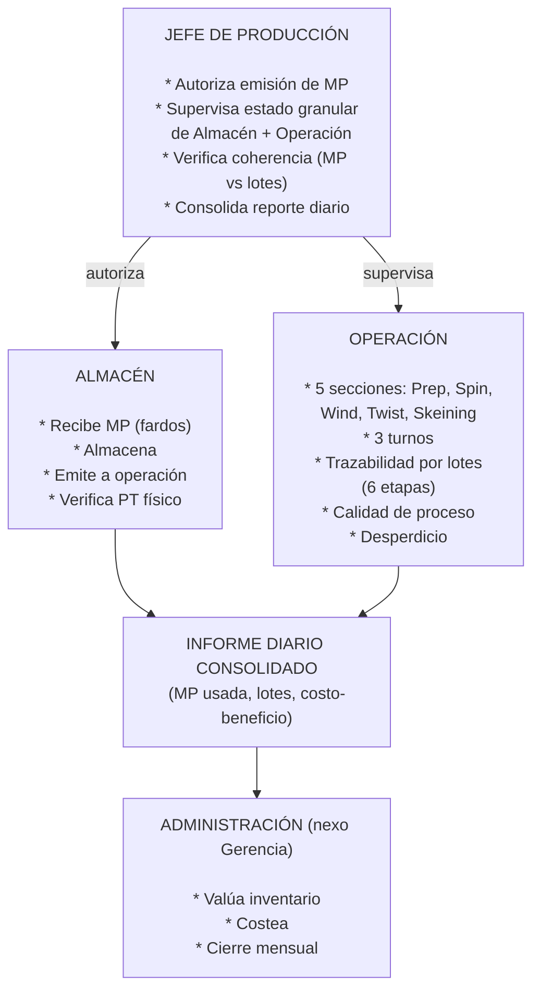
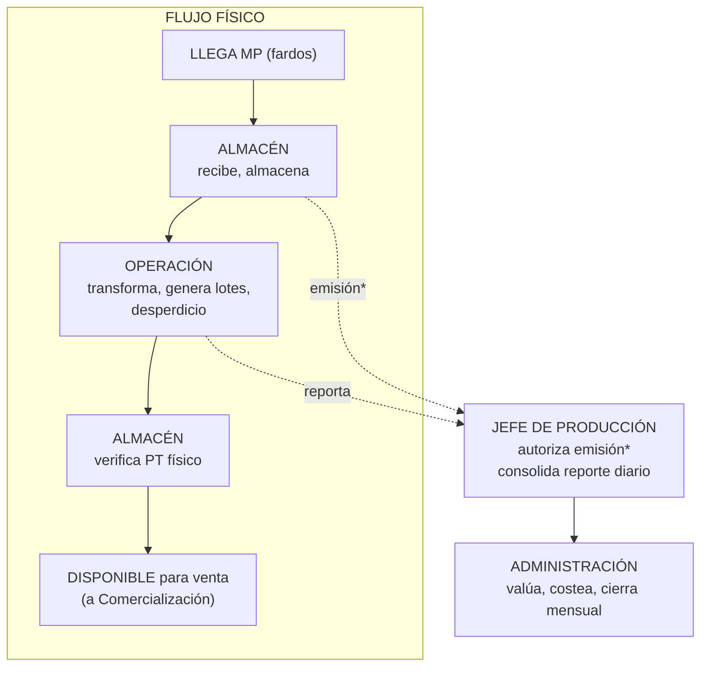

# SISTEMA DE GESTIÓN DE PRODUCCIÓN TEXTIL — PRD

> **Product Requirements Document**
>
> Define el problema, el modelo de dominio y los requerimientos del sistema
> para la **Dirección de Producción** (Unidad Almacén + Unidad Operación)
> y su transmisión de información consolidada hacia **Administración**.
>

---

## 1. Resumen Ejecutivo

### 1.1 Propósito

Sistematizar la gestión de la **Dirección de Producción** de una planta textil,
articulando sus dos unidades internas — Almacén y Operación — bajo la supervisión
del Jefe de Producción, y transmitiendo datos consolidados diarios a un integrante
específico de Administración que reporta a Gerencia.

### 1.2 Dominios de Negocio

```
                  GERENCIA
                     │
          ┌──────────┴──────────┐
          │                     │
          ▼                     │
┌─────────────────────┐        │
│ DIRECCIÓN DE        │        │
│ PRODUCCIÓN          │        │
│                     │        │
│ ┌────────┐ ┌──────┐ │        │
│ │ALMACÉN │ │OPERAC│ │        │
│ │(8 pers)│ │(18 p)│ │        │
│ │        │ │      │ │        │
│ │ Recibe │ │5 secc│ │        │
│ │ Almac. │ │3 tur │ │        │
│ │ Emite  │ │Lotes │ │        │
│ │ Verif. │ │Calid │ │        │
│ │ PT     │ │Desp. │ │        │
│ └───┬────┘ └──┬───┘ │        │
│     │         │     │        │
│     └── Jefe ─┘     │        │
│     Producción      │        │
│     autoriza        │        │
└──────────┬──────────┘        │
           │                   │
           │ Datos diarios     │
           │ consolidados      │
           ▼                   │
┌──────────────────────┐       │
│  ADMINISTRACIÓN      │       │
│  (1 persona -        │       │
│   nexo con Gerencia) │       │
│                      │       │
│  ● Recibe y valúa    │       │
│  ● Costea            │       │
│  ● Cierres mensuales │       │
└──────────────────────┘       │
           │                   │
           └───────────────────┘
```

| Área                              | Personas | Rol en el sistema                                             |
| --------------------------------- | -------- | ------------------------------------------------------------- |
| **Almacén** (dentro de Prod.)     | ~8       | Opera recepción de MP, emisiones, verificación de PT          |
| **Operación** (dentro de Prod.)   | ~18      | Opera máquinas, lotes, calidad, desperdicio                   |
| **Jefe de Producción**            | 1        | Autoriza emisiones, supervisa granular, consolida             |
| **Persona Admin (nexo Gerencia)** | 1        | Recibe consolidados diarios, valúa, cierra mensual            |
| **Resto de Administración**       | ~9       | **Fuera del alcance** — manejan otros procesos (ventas, etc.) |

**Total usuarios activos del sistema: ~28** (26 en Producción + 1 Jefe + 1 Admin).

Adicionalmente hay ~80 operarios por turno que **no usan el sistema**.

### 1.3 Principios de Diseño

1. **El Jefe de Producción es el usuario central.** Necesita visibilidad granular
   de ambas unidades para autorizar, supervisar y detectar incoherencias.

2. **Cada unidad opera su proceso.** Almacén maneja stocks y movimientos.
   Operación maneja máquinas, turnos y lotes. No interfieren entre sí.

3. **El dato se captura una vez en el origen.** No hay planillas paralelas ni
   reingreso de información.

4. **La transmisión a Administración es un subproducto del sistema.** Los
   consolidados diarios se generan automáticamente desde los datos operativos.

5. **Inmutabilidad y auditoría.** Los registros críticos son inmutables.
   Las correcciones son trazables.

6. **Diseñado para la incertidumbre.** Los procesos no completamente definidos
   (insumos, costeo) deben poder agregarse sin reestructurar lo existente.

7. **UI en español, modelo en inglés.** El usuario ve etiquetas en español.
   El modelo de datos, APIs y código van en inglés.

---

## 2. Modelo de Dominio

### 2.1 Mapa General



### 2.2 Flujo de Valor de la Materia Prima



**Puntos clave:**

1. **La MP se emite de forma global.** No se asigna a lotes específicos.
   El costeo será por asignación global o por período.

2. **El Jefe de Producción autoriza cada emisión** de MP de Almacén a Operación.

3. **El Jefe de Producción recibe datos granulares** de ambas unidades y los
   consolida en un reporte diario para Administración.

4. **Administración recibe datos totales** (MP usada, lotes producidos,
   costo-beneficio) no el detalle operativo. Puede abrir detalle si algo no cierra.

5. **Producción y Almacén operan en el mismo galpón/ambiente.** El traspaso físico es
   directo, pero documentalmente queda registrado en el sistema.

### 2.3 Subdominios

#### Operación (dentro de Dirección de Producción)

| Subdominio             | Referencia                                                                                                                                      |
| ---------------------- | ----------------------------------------------------------------------------------------------------------------------------------------------- |
| **Hilatura**           | 5 secciones, producción por máquina/turno, avance, calidad de proceso, desperdicio — documentado en `yarn-production.md`                        |
| **Lotes**              | Trazabilidad por 6 etapas (Inventario → Tintorería → Secado → Devanado → Embolsado → Calidad) con máquina de estados — documentado en `lots.md` |
| **Calidad de Proceso** | Muestras estadísticas por máquina/tipo                                                                                                          |
| **Desperdicio**        | Registro por grupo de máquinas                                                                                                                  |

#### Almacén (dentro de Dirección de Producción)

| Subdominio                      | Estado                                                             |
| ------------------------------- | ------------------------------------------------------------------ |
| **Recepción de MP**             | Definido: ingreso de fardos con características                    |
| **Emisión a Operación**         | Definido: requiere autorización del Jefe de Producción             |
| **Recepción de PT**             | Definido: desde Operación, verificación física antes de disponible |
| **Ubicación física**            | Definido: almacén con ubicaciones                                  |
| **Insumos**                     | **En estudio**: colorantes, auxiliares, etiquetas, envases, conos  |
| **Inventario físico / ajustes** | Definido conceptualmente, detalle pendiente                        |

#### Administración (alcance limitado)

| Subdominio                    | Estado                                              |
| ----------------------------- | --------------------------------------------------- |
| **Recepción de consolidados** | Definido: reporte diario desde Jefe de Producción   |
| **Valuación de inventario**   | Definido: MP, WIP, PT, desperdicio valuado          |
| **Costeo**                    | **Por definir**: método de asignación, periodicidad |
| **Desperdicio valorizado**    | Definido: desperdicio en $$$ mensual/anual          |
| **Cierre mensual**            | Definido                                            |

### 2.4 Relaciones entre Dominios

| Relación                         | Naturaleza                                       |
| -------------------------------- | ------------------------------------------------ |
| Almacén → Operación              | Flujo de MP (emisión autorizada por Jefe Prod.)  |
| Operación → Almacén              | Flujo de PT (entrega de lotes para verificación) |
| Jefe Producción → Almacén        | Autorización de emisión de MP                    |
| Jefe Producción → Operación      | Supervisión granular, verificación de coherencia |
| Jefe Producción → Administración | Reporte diario consolidado                       |
| Administración → Gerencia        | Valuación, costos, cierres                       |

---

## 3. Requerimientos Funcionales

### 3.1 Operación (Dirección de Producción)

| ID     | Requerimiento                                                          | Prioridad |
| ------ | ---------------------------------------------------------------------- | --------- |
| RF-O01 | Registrar producción por máquina/turno/título/fecha en cada sección    | Alta      |
| RF-O02 | Calcular peso neto a partir de peso bruto y tara                       | Alta      |
| RF-O03 | Registrar avance (peso entrada/salida) en secciones con seguimiento    | Alta      |
| RF-O04 | Registrar desperdicio por grupo de máquinas                            | Alta      |
| RF-O05 | Registrar calidad de proceso (muestras estadísticas por máquina)       | Alta      |
| RF-O06 | Registrar trazabilidad de lotes a través de 6 etapas secuenciales      | Alta      |
| RF-O07 | Validar máquina de estados de lote (sin saltos, cuarentena, reproceso) | Alta      |
| RF-O08 | Calcular métricas derivadas: kg/hora, eficiencia, desperdicio %        | Alta      |
| RF-O09 | Permitir corrección trazable de registros con control de versiones     | Media     |
| RF-O10 | Soporte para Madejeras (madejas, no husos)                             | Alta      |
| RF-O11 | Soporte para Bobinados (sin avance, calidad distinta)                  | Alta      |

### 3.2 Almacén (Dirección de Producción)

| ID     | Requerimiento                                                                              | Prioridad |
| ------ | ------------------------------------------------------------------------------------------ | --------- |
| RF-A01 | Registrar recepción de MP (fardos) con fecha, proveedor, camion, cantidad, características | Alta      |
| RF-A02 | Asignar ubicación física a la MP almacenada                                                | Alta      |
| RF-A03 | Registrar emisión de MP a Operación con referencia a autorización del Jefe de Producción   | Alta      |
| RF-A04 | Registrar recepción de producto terminado desde Operación                                  | Alta      |
| RF-A05 | Registrar verificación física de PT antes de marcarlo como disponible                      | Alta      |
| RF-A06 | Registrar movimientos de insumos — **detalle a definir**                                   | Media     |
| RF-A07 | Consultar stock actual de MP, insumos y PT por ubicación y lote                            | Alta      |
| RF-A08 | Registrar ajustes de inventario (sobrantes, faltantes, mermas)                             | Media     |
| RF-A09 | Realizar conteo cíclico / inventario físico                                                | Media     |

### 3.3 Jefe de Producción

| ID     | Requerimiento                                                                     | Prioridad |
| ------ | --------------------------------------------------------------------------------- | --------- |
| RF-J01 | Autorizar o rechazar solicitudes de emisión de MP de Almacén a Operación          | Alta      |
| RF-J02 | Visualizar dashboard granular con estado de Almacén (stocks, ubicaciones)         | Alta      |
| RF-J03 | Visualizar dashboard granular con estado de Operación (secciones, lotes, calidad) | Alta      |
| RF-J04 | Visualizar alertas de coherencia (MP emitida vs lotes producidos)                 | Alta      |
| RF-J05 | Generar y enviar reporte diario consolidado a Administración                      | Alta      |
| RF-J06 | Visualizar historial de autorizaciones de emisión                                 | Media     |
| RF-J07 | Acceder al detalle de cualquier registro en ambas unidades                        | Alta      |

### 3.4 Administración (nexo con Gerencia)

| ID      | Requerimiento                                                           | Prioridad |
| ------- | ----------------------------------------------------------------------- | --------- |
| RF-AD01 | Recibir y visualizar reporte diario consolidado de Producción           | Alta      |
| RF-AD02 | Visualizar MP procesada (kg totales), lotes producidos, costo-beneficio | Alta      |
| RF-AD03 | Acceder a detalle de datos si algo no cierra (drill-down)               | Media     |
| RF-AD04 | Valuar inventario de MP, WIP, PT y desperdicio                          | Alta      |
| RF-AD05 | Calcular costo por período con método de asignación definido            | Alta      |
| RF-AD06 | Cuantificar desperdicio en términos económicos (mensual/anual)          | Alta      |
| RF-AD07 | Realizar cierre mensual                                                 | Alta      |
| RF-AD08 | Generar reportes para Gerencia (stock valorizado, costos, movimientos)  | Alta      |

---

## 4. Requerimientos Transversales

### 4.1 Catálogos Compartidos

| Catálogo                | Usado por                                                           |
| ----------------------- | ------------------------------------------------------------------- |
| **Empleados**           | Operación, Almacén, Jefe Producción                                 |
| **Máquinas**            | Operación (por sección y grupo)                                     |
| **Títulos de hilado**   | Operación, Lotes                                                    |
| **Secciones**           | Operación (Preparación, Continuas, Bobinados, Retorcido, Madejeras) |
| **Turnos**              | Operación, Almacén                                                  |
| **Tipos de MP**         | Almacén                                                             |
| **Ubicaciones físicas** | Almacén                                                             |
| **Unidades de medida**  | Todos (kg, madejas, conos, bolsas)                                  |
| **Proveedores**         | Almacén                                                             |
| **Lotes**               | Operación, Almacén, Administración                                  |

### 4.2 Autenticación

Cada usuario del sistema accede con **usuario y contraseña individuales**. No hay terminales compartidas ni acceso anónimo. La autenticación determina:

- Qué módulos ve (Operación, Almacén, Jefatura, Administración)
- Qué acciones puede realizar (ingresar datos, autorizar, ver reportes)
- Qué registros quedan asociados a su nombre (auditoría)

Esto garantiza trazabilidad desde el día 1 y prepara el sistema para cualquier requerimiento futuro que requiera identidad digital (gestión documental, aprobaciones, etc.).

### 4.3 Roles y Permisos

| Rol                       | Área                 | Alcance                                           |
| ------------------------- | -------------------- | ------------------------------------------------- |
| **Jefe de Producción**    | Dirección Producción | **Todo** — granular, autorizaciones, consolidados |
| **Admin (nexo Gerencia)** | Administración       | Reportes consolidados, valuación, costos, cierres |
| **Supervisor Operación**  | Operación            | Sus secciones, sus turnos                         |
| **Inspector Calidad**     | Operación            | Calidad de proceso + lotes (historial completo)   |
| **Encargado Almacén**     | Almacén              | Stocks, movimientos, recepción, emisión           |
| **Verificador Almacén**   | Almacén              | Verificación de PT                                |

### 4.4 Principios de Persistencia

- **Auditabilidad:** toda transacción crítica (emisión, verificación, ajuste,
  autorización) queda registrada con quién, cuándo y qué cambió.
- **Inmutabilidad selectiva:** los registros de producción, movimientos de
  almacén y autorizaciones son inmutables una vez confirmados. Las correcciones
  son nuevos registros con referencia al original.
- **Dato crudo vs calculado:** se persiste el valor ingresado por el usuario.
  Las métricas derivadas (eficiencia, costos, valorización) se calculan en el
  sistema, no se almacenan como datos de entrada.

### 4.5 Reportes

| Reporte                            | Para                               | Frecuencia        |
| ---------------------------------- | ---------------------------------- | ----------------- |
| Producción del turno               | Supervisores Operación             | Por turno         |
| Eficiencia por sección/máquina     | Supervisores Operación             | Diario            |
| Lotes en proceso / estado          | Jefe Producción + Operación        | Tiempo real       |
| Stock de MP disponible             | Jefe Producción + Almacén          | Diario            |
| PT verificado disponible           | Jefe Producción + Almacén          | Diario            |
| Dashboard granular completo        | **Jefe de Producción**             | Tiempo real       |
| Alerta de coherencia (MP vs lotes) | **Jefe de Producción**             | Diario            |
| Reporte diario consolidado         | **Administración (nexo Gerencia)** | Diario            |
| Stock valorizado                   | Administración                     | Semanal / Mensual |
| Desperdicio valorizado ($$$)       | Administración                     | Mensual / Anual   |
| Costo por período                  | Administración                     | Mensual           |
| Cierre mensual                     | Administración                     | Mensual           |

---

## 5. Arquitectura Preliminar (Conceptual)

> **Nota:** arquitectura en términos de componentes lógicos, sin asumir stack
> tecnológico. La elección se hará una vez validado el modelo de dominio.

### 5.1 Contexto del Sistema (C4 Nivel 1)

```
┌─────────────────────────────────────────────────────────┐
│                 SISTEMA DE PRODUCCIÓN TEXTIL              │
│                                                          │
│  ┌────────────────┐  ┌────────────────┐                  │
│  │   OPERACIÓN     │  │   ALMACÉN      │                  │
│  │  18 usuarios    │  │  8 usuarios    │                  │
│  │                 │  │                │                  │
│  │ - Máquinas      │  │ - Recepción    │                  │
│  │ - Turnos        │  │ - Emisión      │                  │
│  │ - Lotes         │  │ - Stocks       │                  │
│  │ - Calidad       │  │ - Verificación │                  │
│  │ - Desperdicio   │  │                │                  │
│  └────────┬────────┘  └───────┬────────┘                  │
│           │                   │                           │
│           └───────┬───────────┘                           │
│                   │                                       │
│          ┌────────▼────────────┐                          │
│          │   JEFE PRODUCCIÓN   │                          │
│          │   Dashboard + Auth  │                          │
│          └────────┬────────────┘                          │
│                   │                                       │
│          ┌────────▼────────────┐                          │
│          │   BACKEND (API)     │                          │
│          └────────┬────────────┘                          │
│                   │                                       │
│          ┌────────▼────────────┐                          │
│          │     DATABASE        │                          │
│          └─────────────────────┘                          │
│                                                          │
│                   │                                       │
│          ┌────────▼────────────┐                          │
│          │   ADMIN (nexo      │                          │
│          │   Gerencia)        │                          │
│          │   1 usuario        │                          │
│          └─────────────────────┘                          │
└──────────────────────────────────────────────────────────┘
```

### 5.2 Decisiones Arquitectónicas Clave

1. **Aplicación monolítica con separación modular.** No hay microservicios.
   El equipo es pequeño, los dominios están fuertemente acoplados a nivel de
   datos (el flujo de MP los atraviesa). Separación por módulos/carpetas.

2. **Base de datos única con esquemas por dominio.** Una sola BD relacional
   con separación lógica (esquemas o prefijos: `op_*`, `wh_*`, `admin_*`,
   `shared_*`). Esto permite joins entre dominios sin complejidad de integración.

3. **API-first.** Toda la lógica de negocio se expone a través de una API.
   La interfaz de usuario es un cliente más. Permite agregar clientes en el futuro
   (móvil, integración con Comercialización, etc.).

4. **El dashboard del Jefe de Producción es la pantalla más importante del sistema.**
   Debe consolidar datos de ambos módulos en tiempo real con alertas de coherencia.

5. **La transmisión a Administración es automática.** El reporte diario se genera
   desde los datos operativos. No hay acción manual de "enviar" — el sistema lo produce.

6. **Reportes en el mismo sistema.** Los reportes operativos diarios viven dentro
   del sistema. Para análisis histórico avanzado se puede agregar BI externo después.

7. **Diseñado para evolucionar.** Los subdominios "en estudio" (insumos, costeo)
   deben poder agregarse sin reestructurar lo existente.

### 5.3 Vista Lógica de Componentes

```
┌─────────────────────────────────────────────────────────┐
│                     FRONTEND (Web App)                  │
│  ┌──────────────┐ ┌──────────────┐ ┌──────────────────┐ │
│  │ Módulo       │ │ Módulo       │ │ Dashboard        │ │
│  │ Operación    │ │ Almacén      │ │ Jefe Producción  │ │
│  │              │ │              │ │                  │ │
│  │ - Planilla   │ │ - Recepción  │ │ - Autorizaciones │ │
│  │   x turno    │ │ - Emisión    │ │ - Coherencia     │ │
│  │ - Lotes      │ │ - Stocks     │ │ - Consolidado    │ │
│  │ - Calidad    │ │ - Verif. PT  │ │ - Reportes       │ │
│  │ - Reportes   │ │ - Reportes   │ │                  │ │
│  └──────┬───────┘ └──────┬───────┘ └────────┬─────────┘ │
│         │                │                  │           │
│         └───────┬────────┴─────────┬────────┘           │
└─────────────────┼──────────────────┼────────────────────┘
                  │                  │
       ┌──────────▼──────────────────▼──────────┐
       │        FRONTEND ADMIN (nexo Gerencia)    │
       │   Reportes consolidados, valuación,      │
       │   costos, cierres                       │
       └──────────────────┬──────────────────────┘
                          │
                          ▼
┌────────────────────────────────────────────────────────┐
│                API / BACKEND (Business Logic)            │
│                                                         │
│  ┌────────────┐ ┌────────────┐ ┌──────────────────────┐│
│  │ Op.Module  │ │ Wh.Module  │ │ Admin.Module (lite)  ││
│  │            │ │            │ │                      ││
│  │ - Machine  │ │ - Receipt  │ │ - Consolidation      ││
│  │ - Shifts   │ │ - Issue    │ │ - Valuation          ││
│  │ - Quality  │ │ - Stock    │ │ - Costing            ││
│  │ - Batches  │ │ - Verify   │ │ - Close              ││
│  │ - Waste    │ │            │ │                      ││
│  └──────┬─────┘ └─────┬──────┘ └──────────┬───────────┘│
│         │             │                   │             │
│         └──────┬──────┴─────────┬─────────┘             │
│                ▼                ▼                       │
│  ┌────────────────┐  ┌────────────────────┐             │
│  │ Auth & Roles   │  │ Shared Catalogs    │             │
│  └────────────────┘  └────────────────────┘             │
└────────────────────────────────────────────────────────┘
                        │
                        ▼
┌────────────────────────────────────────────────────────┐
│                    DATABASE (RDBMS)                      │
│                                                         │
│  ┌─────────────┐ ┌─────────────┐ ┌───────────────────┐ │
│  │ op_*        │ │ wh_*        │ │ admin_*           │ │
│  │ (operación) │ │ (almacén)   │ │ (valuación,       │ │
│  │             │ │             │ │  costos, cierres)  │ │
│  └─────────────┘ └─────────────┘ └───────────────────┘ │
│  ┌──────────────────────────────────────────────────┐   │
│  │ shared_* (catálogos: employees, machines, etc.)  │   │
│  └──────────────────────────────────────────────────┘   │
└────────────────────────────────────────────────────────┘
```

---

## 6. Incertidumbres y Riesgos

| Ítem                                 | Riesgo                                                                                                                           | Impacto                                                                                                                                                                                                                             |
| ------------------------------------ | -------------------------------------------------------------------------------------------------------------------------------- | ----------------------------------------------------------------------------------------------------------------------------------------------------------------------------------------------------------------------------------- |
| **Asignación de costos**             | No se asigna MP a lotes específicos. Método de costeo sin definir                                                                | Afecta el modelo de datos de Administración                                                                                                                                                                                         |
| **Insumos**                          | Detalle de colorantes, auxiliares, etiquetas, envases en estudio                                                                 | Módulo de Almacén queda parcial                                                                                                                                                                                                     |
| **Integración con Comercialización** | Fuera de alcance, pero el PT "disponible para venta" es insumo para ellos                                                        | Hay que definir el límite y el formato de salida                                                                                                                                                                                    |
| **Perfil del Jefe de Producción**    | Si el sistema requiere mucha interacción del Jefe, puede ser un cuello de botella                                                | La UX del dashboard debe ser inmediata, no demandante                                                                                                                                                                               |
| **Adopción**                         | Usuarios vienen de Excel y papel                                                                                                 | UX debe priorizar simplicidad                                                                                                                                                                                                       |
| **Migración**                        | Datos históricos en Excel, papeles, planillas varias                                                                             | Requiere plan aparte                                                                                                                                                                                                                |
| **Gestión documental futura**        | Los propietarios podrían solicitar gestión documental (subida de PDFs, bandeja de aprobaciones, imágenes) en una etapa posterior | No está en alcance actual, pero impacta autenticación, almacenamiento, modelo de datos y frontend. **Mitigación:** el diseño con login individual ya prepara el terreno. El almacenamiento de archivos será una extensión posterior |

### Decisiones Diferidas

1. Método de costeo de MP
2. Nivel de detalle de insumos
3. Periodicidad de cierres (mensual parece estable)
4. Infraestructura (on-premise vs cloud)
5. Stack tecnológico
6. Gestión documental (fuera de alcance del PRD inicial)

---

## 7. Glosario

| Término                 | Definición                                                                                 |
| ----------------------- | ------------------------------------------------------------------------------------------ |
| **MP**                  | Materia prima (fardos de fibra/textil) que ingresa al proceso productivo                   |
| **PT**                  | Producto terminado (hilado en madejas o conos) listo para venta                            |
| **WIP**                 | Work in Progress — producto en proceso dentro de Operación                                 |
| **Insumos**             | Materiales consumibles: colorantes, auxiliares químicos, etiquetas, bolsas, conos, envases |
| **Lote**                | Conjunto de madejas que comparten título, color y cliente, ID único LTT-YYYYMMDD-NNN       |
| **Sección**             | Etapa productiva: Preparación, Continuas, Bobinados, Retorcido, Madejeras                  |
| **Turno**               | Bloque de trabajo diario (A, B, C)                                                         |
| **Unidad Almacén**      | Subdirección dentro de Producción que gestiona MP, insumos y PT                            |
| **Unidad Operación**    | Subdirección dentro de Producción que transforma MP en PT                                  |
| **Flujo de valor**      | Recorrido de la MP desde que ingresa hasta que sale como PT disponible                     |
| **Asignación global**   | Método de costeo donde la MP se asigna a períodos, no a lotes específicos                  |
| **Verificación física** | Proceso de Almacén que revisa el PT antes de marcarlo como disponible                      |
