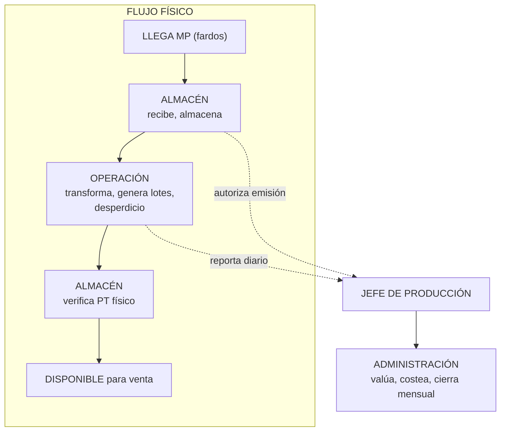

# SISTEMA DE GESTIÓN DE PRODUCCIÓN TEXTIL — PRD Maestro

> **Product Requirements Document — Contrato Ejecutivo**
>
> Define el problema, el alcance y las reglas de dominio del sistema
> para la **Dirección de Producción** (Unidad Almacén + Unidad Operación)
> y su transmisión de información consolidada hacia **Gerencia**.
>
> Los PRD de detalle viven en `docs/prd/`:
>
> - [`docs/prd/warehouse.md`](./prd/warehouse.md) — Unidad Almacén
> - `docs/prd/operation.md` — Unidad Operación

---

## 1. Propósito

Sistematizar la gestión de la **Dirección de Producción** de una planta textil,
articulando sus dos unidades internas — Almacén y Operación — bajo la supervisión
del Jefe de Producción, eliminando planillas paralelas en Excel y papel, y
transmitiendo datos consolidados diarios a Gerencia.

---

## 2. Estructura organizacional

### 2.1 Organigrama del sistema

```
                   GERENCIA
                      │
        ┌─────────────┼─────────────┐
        │             │             │
        ▼             ▼             ▼
   ┌─────────┐ ┌───────────┐ ┌────────────────┐
   │PRODUC-  │ │ADMINIS-   │ │COMERCIALIZA-   │
   │CIÓN     │ │TRACIÓN    │ │CIÓN            │
   └────┬────┘ └───────────┘ └────────────────┘
        │
        ▼
┌──────────────────────────────┐
│   DIRECCIÓN DE PRODUCCIÓN    │
│                              │
│  ┌──────────────────────┐   │
│  │ JEFE DE PRODUCCIÓN   │   │
│  │ Autoriza, supervisa, │   │
│  │ consolida reporte    │   │
│  └────────┬─────────────┘   │
│           │                 │
│     ┌─────┴─────┐           │
│     │           │           │
│     ▼           ▼           │
│ ┌────────┐ ┌──────────┐    │
│ │ALMACÉN │ │OPERACIÓN │    │
│ │Jefe +  │ │Supervis. │    │
│ │Auxil.  │ │(x turno) │    │
│ └────────┘ └──────────┘    │
└───────────────┬─────────────┘
                │
                │ Reporte diario
                │ consolidado
                ▼
┌──────────────────────────────┐
│  ADMINISTRACIÓN              │
│  1 persona (nexo Gerencia)   │
│  Recibe, valúa, costea,      │
│  cierra mensual              │
└──────────────────────────────┘
```

**Nota:** El sistema cubre la **Dirección de Producción**. El destino del reporte
consolidado es la persona responsable de Gerencia
(alcance limitado a la recepción del reporte). Las direcciones de Administración y Comercialización están fuera de alcance.

### 2.2 Roles del sistema

| Rol | Cant. | Responsabilidades en el sistema |
|-----|-------|---------------------------------|
| **Jefe de Producción** | 1 | Autoriza emisiones de MP, supervisa dashboard granular de ambas unidades, verifica coherencia (MP emitida vs lotes producidos), consolida y envía reporte diario a Administración. La Secretaria (parte de su equipo) opera el sistema en conjunto con el Jefe de Produccion, principalmente para tareas de supervisión, análisis y reportes. |
| **Jefe Unidad Almacén** | 1 | Supervisa recepción de MP, emisiones a Operación, verificación de PT, control de inventarios. Opera el sistema. Reporta al Jefe de Producción. |
| **Auxiliar Operativo (Almacén)** | — | Ejecuta movimientos físicos: recepción, verificación, embolsado, despacho. Opera el sistema para registrar movimientos. |
| **Supervisor** | 3 (1 por turno) | Está a cargo de la operación en su turno. Registra producción por sección, control de calidad, lotes y desperdicio **directamente en el sistema**. Reporta al Jefe de Producción. |
| **Gerencia** | 1 | Recibe reporte diario consolidado, valúa inventarios, costea, realiza cierre mensual. |
| **Operarios** | — | **No usan el sistema.** Operan máquinas. Su producción es registrada por los supervisores en el sistema. |

### 2.3 Principios de diseño

1. **El Jefe de Producción es el usuario central.** Necesita visibilidad granular
   de ambas unidades para autorizar, supervisar y detectar incoherencias.

2. **Cada unidad opera su proceso.** Almacén gestiona stocks y movimientos.
   Operación gestiona máquinas, turnos y lotes. No interfieren entre sí.

3. **El dato lo captura quien lo genera.** El Supervisor registra producción,
   calidad y lotes directamente en el sistema. No hay intermediarios ni
   planillas paralelas.

4. **Trazabilidad de principio a fin.** Todo lote de MP debe tener su PT
   correspondiente (no se admiten huérfanos). Y cada lote en Operación recorre
   6 etapas secuenciales con máquina de estados — sin saltos, con cuarentena
   y reproceso documentados.

5. **La operación es continua por turnos.** 3 turnos, cada uno con un Supervisor
   a cargo. La producción no se detiene. El sistema debe soportar el traspaso
   de información entre turnos sin pérdida ni duplicación.

6. **La transmisión a Administración es un subproducto del sistema.** Los
   consolidados diarios se generan automáticamente desde los datos operativos.

7. **Inmutabilidad y auditoría.** Los registros críticos (movimientos de almacén,
   producción, autorizaciones) son inmutables. Las correcciones son trazables.

8. **Diseñado para la incertidumbre.** Los procesos no completamente definidos
   (insumos, costeo) deben poder agregarse sin reestructurar lo existente.

---

## 3. Dominios de negocio

### 3.1 Mapa general — Flujo de valor de la MP



**Puntos clave del flujo:**

1. **El ciclo del lote en Operación tiene 6 etapas internas:** Inventario →
   Tintorería → Secado → Devanado → Embolsado → Calidad. Cada etapa tiene
   su propia máquina de estados. El lote no puede saltarse etapas.

2. **El Jefe de Producción autoriza cada emisión** de MP de Almacén a Operación.

3. **Trazabilidad obligatoria:** todo lote de MP ingresado debe tener su
   correspondiente PT. No se admiten lotes huérfanos.

4. **Producción y Almacén operan en el mismo galpón.** El traspaso físico es
   directo, pero documentalmente queda registrado en el sistema.

5. **El reporte diario a Administración es automático.** Se genera desde los datos
   operativos sin intervención manual.

### 3.2 Inventario de subdominios

#### Unidad Almacén

| Subdominio | Descripción | Documentado en |
|---|---|---|
| **Materia Prima (MP)** | Recepción de fardos de hilado base. Asigna código `NN-GGGG-NNN` a cada lote. Enriquece el lote con datos del pedido (título, color, cliente). Ese código es el identificador único que usa todo el proceso. | `docs/prd/warehouse.md` |
| **Producto Terminado (PT)** | Inventario de hilado procesado que llega desde Operación. Almacén registra entradas, salidas y saldos. Fórmula: (Saldo Ant. + Entradas) − Salidas = Saldos. Las nomenclaturas especiales (-D, -FT, etc.) las asigna Control de Calidad en Operación, Almacén solo recibe. | `docs/prd/warehouse.md` |
| **Tintorería** | Colorantes e insumos químicos. Movimientos: ingreso, muestra, inventario, etc. | `docs/prd/warehouse.md` |
| **Bolsas, Etiquetas, Fichas, Talonarios** | Insumos de empaque. Unidad: piezas (no kg). | `docs/prd/warehouse.md` |

#### Unidad Operación

| Subdominio | Descripción | Documentado en |
|---|---|---|
| **Hilatura** | 5 secciones productivas (Preparación, Continuas, Bobinados, Retorcido, Madejeras), 3 turnos. Cada turno tiene un Supervisor a cargo. Producción registrada por máquina/turno/título, avance (peso entrada/salida), calidad de proceso (muestras estadísticas), y desperdicio por grupo de máquinas. Soporte para Madejeras (madejas, no husos) y Bobinados (sin avance, calidad distinta). | `docs/prd/operation.md` _(próximamente)_ |
| **Lotes** | El código del lote lo asigna Almacén al recibir la MP (`NN-GGGG-NNN`) y es el mismo que usa Operación durante todo el proceso. Trazabilidad por 6 etapas secuenciales: Inventario → Tintorería → Secado → Devanado → Embolsado → Calidad. Cada etapa con máquina de estados (pendiente, en proceso, completado, en cuarentena, reproceso). Sin saltos de etapa permitidos. | `docs/prd/operation.md` |
| **Calidad de Proceso** | Muestras estadísticas por máquina/tipo. Control en cada sección, con capacidad de poner lotes en cuarentena si no pasan control. Asigna nomenclaturas especiales al PT (-AT alta torsion, -FT fuera de tabla, -VARR con varrilla, etc). Historial completo de calidad por lote. | `docs/prd/operation.md` |
| **Desperdicio** | Registro por grupo de máquinas. Dos tipos: **real** y **acumulado**. Se denomina "desperdicio teórico" a la suma de ambos. | `docs/prd/operation.md` |

#### Administración (alcance limitado)

| Subdominio | Estado |
|---|---|
| **Recepción de consolidados** | Definido: reporte diario generado automáticamente desde datos operativos |
| **Valuación de inventario** | Definido: MP, WIP, PT, desperdicio valuado |
| **Costeo** | **Por definir**: método de asignación, periodicidad |
| **Cierre mensual** | Definido |

### 3.3 Relaciones entre dominios

| Relación | Naturaleza |
|---|---|
| Almacén → Operación | Flujo de MP (emisión autorizada por Jefe de Producción) |
| Operación → Almacén | Flujo de PT (entrega de lotes para verificación física) |
| Jefe Producción → Almacén | Autorización de emisión de MP, supervisión de stocks |
| Jefe Producción → Operación | Supervisión granular, verificación de coherencia |
| Jefe Producción → Administración | Reporte diario consolidado automático |
| Administración → Gerencia | Valuación, costos, cierres |

---

## 4. Catálogos compartidos

| Catálogo | Usado por |
|---|---|
| **Empleados** | Operación, Almacén, Jefe Producción |
| **Máquinas** | Operación (por sección y grupo) |
| **Títulos de hilado** | Operación, Lotes |
| **Secciones** | Operación (Preparación, Continuas, Bobinados, Retorcido, Madejeras) |
| **Turnos** | Operación, Almacén |
| **Tipos de MP** | Almacén |
| **Ubicaciones físicas** | Almacén |
| **Unidades de medida** | Todos (kg, madejas, conos, bolsas, piezas) |
| **Proveedores** | Almacén |
| **Lotes** | Operación, Almacén, Administración |

---

## 5. Incertidumbres y riesgos

| Ítem | Riesgo | Impacto |
|---|---|---|
| **Insumos (Tintorería + Empaque)** | Detalle de colorantes, químicos, bolsas, etiquetas ya definido pero no implementado | Módulo de Almacén requiere cubrir los 4 subdominios |
| **Integración con Comercialización** | Fuera de alcance, pero el PT "disponible para venta" es insumo para ellos | Hay que definir el límite y el formato de salida |
| **Perfil del Jefe de Producción** | Si el sistema requiere mucha interacción del Jefe de Produccion, puede ser un cuello de botella | La UX del dashboard debe ser inmediata, no demandante |
| **Adopción** | Usuarios vienen de Excel y papel | UX debe priorizar simplicidad |
| **Migración** | Datos históricos en Excel, papeles, planillas varias. | Requiere plan aparte |
| **Desperdicio teórico** | Almacén usa "desperdicio teórico" para referirse a real + acumulado, pero el acumulado lo gestiona Producción | Riesgo de confusión en reportes si no se separa conceptualmente |

### Decisiones diferidas

1. Periodicidad de cierres (mensual parece estable)
2. Infraestructura (cloud)
3. Stack tecnológico

---

## 6. Glosario

| Término | Definición |
|---|---|
| **MP** | Materia prima (fardos de hilado base) que ingresa al proceso productivo |
| **PT** | Producto terminado (hilado en madejas o conos) listo para venta |
| **WIP** | Work in Progress — producto en proceso dentro de Operación |
| **Insumos** | Materiales consumibles: colorantes, auxiliares químicos, etiquetas, bolsas, conos |
| **Lote** | Conjunto de madejas que comparten título, color, cliente,etc |
| **Sección** | Etapa productiva: Preparación, Continuas, Bobinados, Retorcido, Madejeras |
| **Turno** | Bloque de trabajo diario (A, B, C) |
| **Unidad Almacén** | Unidad dentro de Dirección de Producción que gestiona MP, insumos y PT |
| **Unidad Operación** | Unidad dentro de Dirección de Producción que transforma MP en PT |
| **Flujo de valor** | Recorrido de la MP desde que ingresa hasta que sale como PT disponible |
| **Verificación física** | Proceso de Almacén que revisa el PT antes de marcarlo como disponible |
| **Desperdicio teórico** | Término usado que engloba desperdicio real + acumulado. El acumulado lo gestiona Producción |
| **Peso por título** | El peso esperado de PT se determina por el título del hilado (ej. 2/18), no por un valor fijo |
| **Codificación de lote MP** | Formato `NN-GGGG-NNN` donde NN = camión distribuidor, GGGG = gestión, NNN = número de ingreso |
| **Título** | Designación del grosor del hilado (ej. 2/18, 2/32, 4/9). Determina el peso del PT |
| **Saldo** | Stock calculado: (Saldo Anterior + Entradas) − Salidas |
