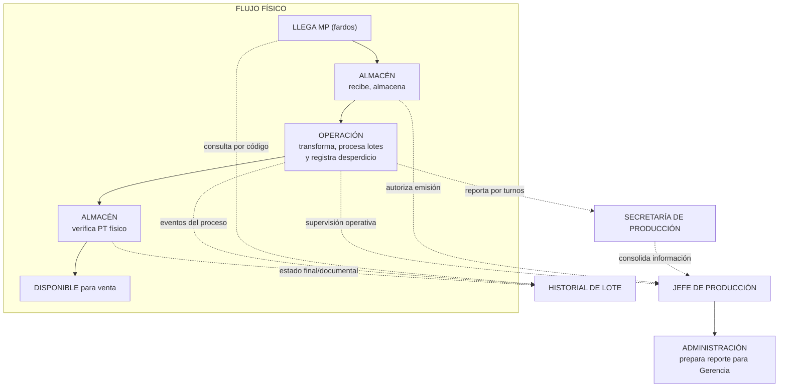

# SISTEMA DE GESTIÓN DE PRODUCCIÓN TEXTIL — PRD Maestro

> **Product Requirements Document — Contrato Ejecutivo**
>
> Define el problema, el alcance y las reglas de dominio del sistema
> para la **Dirección de Producción** (Unidad Almacén + Unidad Operación)
> y su transmisión de información consolidada hacia **Administración**,
> como nexo formal hacia **Gerencia**.
>
> Los PRD de detalle viven en `docs/prd/`:
>
> - [`docs/prd/warehouse.md`](./prd/warehouse.md) — Unidad Almacén
> - [`docs/prd/operation.md`](./prd/operation.md) — Unidad Operación

---

## 1. Propósito

Sistematizar la gestión de la **Dirección de Producción** de una planta textil,
articulando sus dos unidades internas — Almacén y Operación — bajo la supervisión
del Jefe de Producción, eliminando planillas paralelas en Excel y papel, y
consolidando información confiable para su transmisión hacia **Administración**,
que actúa como nexo formal hacia **Gerencia**.

Este PRD maestro define el marco común, los actores, las reglas transversales y
las relaciones entre unidades. Los procesos específicos de cada unidad se
detallan en los PRD encadenados de `docs/prd/`.

---

## 2. Estructura organizacional

### 2.1 Organigrama del sistema

```
                  GERENCIA
                     │
                     ▼
              ADMINISTRACIÓN
         (recibe información consolidada,
          prepara reporte para Gerencia)
                     │
                     ▼
         DIRECCIÓN DE PRODUCCIÓN
                     │
      ┌──────────────┼──────────────┐
      │              │              │
      ▼              ▼              ▼
JEFE DE PRODUCCIÓN SECRETARÍA   UNIDADES OPERATIVAS
 (supervisa,       DE PRODUCCIÓN  (Almacén y Operación)
 autoriza,         (recopila,
 valida            consolida y
 coherencia)       da soporte)
                                     │
                           ┌─────────┴─────────┐
                           ▼                   ▼
                     UNIDAD ALMACÉN     UNIDAD OPERACIÓN
                     (Jefe + Auxil.)    (Supervisores por turno)
```

**Nota:** El sistema cubre la **Dirección de Producción**. **Administración**
participa en este alcance únicamente como receptora de información consolidada y
como nexo formal para la preparación del reporte hacia **Gerencia**.
**Comercialización** está fuera de alcance.

**Regla transversal de permisos:** la estructura organizacional y los permisos
del sistema están relacionados, pero no son equivalentes. Los cargos,
responsabilidades y permisos pueden evolucionar con el tiempo entre distintas
direcciones y áreas. El sistema debe permitir reasignar permisos de registro,
validación, aprobación, consolidación y consulta sin rediseñar los procesos de
negocio. La política transversal de autorización se define en
`docs/prd/access-control.md`.

| Rol | Cant. | Responsabilidades en el sistema |
|-----|-------|---------------------------------|
| **Jefe de Producción** | 1 | Autoriza emisiones de MP, supervisa dashboard granular de ambas unidades, verifica coherencia (MP emitida vs lotes producidos), consolida y envía reporte diario a Administración. La Secretaria (parte de su equipo) opera el sistema en conjunto con el Jefe de Produccion, principalmente para tareas de supervisión, análisis y reportes. |
| **Jefe Unidad Almacén** | 1 | Supervisa recepción de MP, emisiones a Operación, verificación de PT, control de inventarios. Opera el sistema. Reporta al Jefe de Producción. |
| **Auxiliar Operativo (Almacén)** | — | Ejecuta movimientos físicos: recepción, verificación, embolsado, despacho. Opera el sistema para registrar movimientos. |
| **Supervisor** | 3 (uno por cada turno: mañana, tarde, noche) | Está a cargo de la operación **exclusivamente en su turno**. Los turnos son secuenciales — solo un Supervisor trabaja a la vez. Al finalizar su turno, registra producción por sección, control de calidad, lotes y desperdicio **directamente en el sistema**. Reporta al Jefe de Producción. |
| **Gerencia** | 1 | Recibe reporte diario consolidado, valúa inventarios, costea, realiza cierre mensual. |
| **Operarios** | — | **No usan el sistema.** Operan máquinas. Su producción es registrada por los supervisores en el sistema. |

| Actor | Cant. | Responsabilidad de negocio |
|---|---:|---|
| **Gerencia** | 1 | Recibe reportes consolidados preparados por Administración para seguimiento del desempeño productivo. |
| **Administración** | 1 | Actúa como nexo entre Dirección de Producción y Gerencia. Recibe información consolidada, la ordena para reporte gerencial y participa en procesos de valuación, costeo y cierre mensual. |
| **Jefe de Producción** | 1 | Responsable de la Dirección de Producción. Supervisa ambas unidades, autoriza emisiones de MP a Operación, valida coherencia operativa y dirige la consolidación de información. |
| **Secretaría de Producción** | 1 | Recopila y organiza información de la Unidad Operación, incluyendo los 3 turnos, y apoya al Jefe de Producción en tareas de seguimiento, consolidación y consulta. |
| **Jefe Unidad Almacén** | 1 | Supervisa recepción de MP, movimientos internos, verificación de PT y control documental/físico de inventarios. |
| **Supervisores de Turno** | 3 (1 por turno) | Son los responsables de la Unidad Operación por turno y coordinan a su personal dependiente. Aseguran la continuidad operativa y el registro de producción, calidad, lotes y novedades de proceso. |
| **Personal dependiente de Supervisión** | — | Incluye funciones como Control de Calidad, Inventario, Tintorero y Embolsado. Ejecutan tareas operativas y registran en el sistema los eventos de su sección según corresponda. |
| **Auxiliares Operativos de Almacén** | — | Ejecutan movimientos físicos y registran operaciones de almacén según corresponda. |
| **Operarios** | — | Ejecutan la operación física en máquinas. No son responsables del registro principal del sistema salvo que su función esté formalizada dentro del personal dependiente de Supervisión. |

### 2.3 Usuarios del sistema y capacidades

| Usuario del sistema | Capacidades principales |
|---|---|
| **Jefe de Producción** | Supervisar ambas unidades, autorizar emisiones, consultar dashboards, validar coherencia entre movimientos y producción, revisar trazabilidad y acceder a reportes consolidados. |
| **Secretaría de Producción** | Consultar información operativa, recopilar datos de turnos, asistir en consolidación y preparar información para seguimiento interno y reporte. |
| **Jefe Unidad Almacén** | Registrar y supervisar recepciones, emisiones, verificaciones y movimientos de inventario. |
| **Auxiliar Operativo (Almacén)** | Registrar movimientos operativos de almacén según permisos definidos. |
| **Supervisor** | Supervisar el turno, consolidar su información operativa y asegurar coherencia entre producción, calidad, lotes, incidencias y novedades. El registro directo depende de la política vigente de permisos. |
| **Control de Calidad** | Registrar controles de proceso, resultados, observaciones y nomenclaturas especiales del PT según permisos definidos. |
| **Inventario (Operación)** | Registrar estados de lote y eventos de transición dentro del flujo operativo según permisos definidos. |
| **Tintorero** | Registrar eventos y resultados asociados a su sección dentro del ciclo del lote. |
| **Embolsado** | Registrar eventos y resultados asociados a su sección dentro del ciclo del lote. |
| **Administración** | Consultar información consolidada de producción para preparar reportes a Gerencia y alimentar procesos administrativos posteriores. |

**Regla general:** los usuarios del sistema en Operación incluyen al Supervisor y a
los roles dependientes de su unidad cuando deben registrar eventos de proceso o
control. La asignación exacta de permisos no se fija rígidamente por cargo y
puede cambiar por decisión organizacional. El detalle operativo se desarrolla en
`docs/prd/operation.md`, y la política transversal de autorización en
`docs/prd/access-control.md`.

### 2.4 Principios de diseño

1. **El Jefe de Producción es el usuario central.** Necesita visibilidad granular
   de ambas unidades para autorizar, supervisar y detectar incoherencias.

2. **Cada unidad opera su proceso.** Almacén gestiona stocks y movimientos.
   Operación gestiona máquinas, turnos y lotes. Ambas unidades están
   coordinadas por reglas, eventos y trazabilidad compartida.

3. **El dato lo captura quien lo genera o controla.** El Supervisor y los roles
   operativos habilitados registran producción, calidad, estados y lotes
   directamente en el sistema. No hay reconstrucción posterior desde planillas
   paralelas.

4. **Trazabilidad de principio a fin.** Todo lote de MP debe conservar un
   historial auditable de su recorrido, incluyendo secciones, fechas e
   incidencias relevantes. En Operación, cada lote recorre 6 etapas
   secuenciales sin saltos, y cualquier observación, reproceso o condición de
   entrega debe quedar documentada en su historial.

5. **La operación es continua por turnos secuenciales.** 3 turnos (mañana,
    tarde, noche). La producción no se detiene, pero la captura digital ocurre
    al final de cada turno. El sistema debe permitir que el siguiente turno
    consulte los datos del turno anterior sin pérdida ni duplicación.

6. **La transmisión a Administración es un resultado del sistema.** La
   información consolidada se construye desde los datos operativos para su
   posterior preparación y reporte hacia Gerencia.

7. **Edición controlada y auditoría.** Los registros críticos (movimientos de
   almacén, producción, autorizaciones y eventos de lote) no se eliminan. Las
   correcciones permitidas deben preservar trazabilidad histórica completa.

8. **Diseñado para la incertidumbre.** Los procesos no completamente definidos
    (insumos, costeo) deben poder agregarse sin reestructurar lo existente.

### 2.4 Modelo de Captura de Datos

Este sistema **no es tiempo real ni streaming**. Los datos operativos se
capturan de la siguiente manera:

| Aspecto | Detalle |
|---|---|
| **Turnos** | 3 turnos **secuenciales** (mañana, tarde, noche). Solo un turno opera a la vez. |
| **Captura física** | Durante el turno, los operarios producen y anotan datos en papel o planillas auxiliares. |
| **Captura digital** | Al finalizar el turno, el encargado (Supervisor, Calidad o Inventario según el ámbito) **registra todos los datos del turno en el sistema en una sola sesión**. |
| **Concurrencia** | No hay registros simultáneos entre turnos — cada turno registra cuando el anterior ya terminó. |
| **Timestamps** | Las fechas y horas registradas reflejan **cuándo ocurrió físicamente el evento** (ej: una descarga a las 10:30 AM), no cuándo se digitalizó (ej: cierre de turno a las 2:00 PM). |
| **Inmutabilidad** | Una vez registrado, el dato no se modifica. Las correcciones son nuevos registros con trazabilidad al original. |

**Ejemplo:** El turno mañana (6:00 AM - 2:00 PM) opera la planta. A las 2:00 PM,
el Supervisor de ese turno registra en el sistema todas las descargas, avances
y movimientos que ocurrieron entre las 6:00 AM y las 2:00 PM. Luego el turno
tarde (2:00 PM - 10:00 PM) comienza y repite el proceso al finalizar.

---

## 3. Dominios de negocio

### 3.1 Mapa general — Flujo de información y trazabilidad



**Puntos clave del flujo:**

1. **El ciclo del lote en Operación tiene 6 etapas internas:** Inventario →
   Tintorería → Secado → Devanado → Embolsado → Calidad. Cada etapa tiene
   su propia máquina de estados. El lote no puede saltarse etapas.

2. **El Jefe de Producción autoriza cada emisión** de MP de Almacén a Operación.

3. **Trazabilidad obligatoria:** cada lote conserva un historial auditable de su
   recorrido, sus fechas y sus incidencias relevantes. El historial no se
   elimina y puede consultarse por código de lote.

4. **Producción y Almacén operan en el mismo galpón.** El traspaso físico es
   directo, pero documentalmente queda registrado en el sistema.

5. **La información consolidada llega a Administración** como insumo para la
   preparación del reporte hacia Gerencia.

### 3.2 Inventario de subdominios

#### Unidad Almacén

| Subdominio | Descripción | Documentado en |
|---|---|---|
| **Materia Prima (MP)** | Recepción de fardos de hilado base. Asigna código `NN-GGGG-NNN` a cada lote. Enriquece el lote con datos del pedido (título, color, cliente). Ese código es el identificador único que usa todo el proceso. | `docs/prd/warehouse.md` |
| **Producto Terminado (PT)** | Inventario de hilado procesado que llega desde Operación. Almacén registra entradas, salidas y saldos. Fórmula: (Saldo Ant. + Entradas) − Salidas = Saldos. Las nomenclaturas especiales (-D, -FT, etc.) las asigna Control de Calidad en Operación, Almacén solo recibe. | `docs/prd/warehouse.md` |
| **Tintorería** | Colorantes e insumos químicos. Movimientos: ingreso, muestra, inventario, etc. | `docs/prd/warehouse.md` |
| **Bolsas, Etiquetas, Fichas, Talonarios** | Insumos de empaque. Unidad: piezas (no kg). | `docs/prd/warehouse.md` |

#### Unidad Operación

| Subdominio | Descripción | Documentado en |
|---|---|---|
| **Hilatura** | 5 secciones productivas (Preparación, Continuas, Bobinados, Retorcido, Madejeras), 3 turnos. Cada turno tiene un Supervisor a cargo. Producción registrada por máquina/turno/título, avance (peso entrada/salida), calidad de proceso (muestras estadísticas), y desperdicio por grupo de máquinas. Soporte para Madejeras (madejas, no husos) y Bobinados (sin avance, calidad distinta). | `docs/prd/operation.md` _(próximamente)_ |
| **Lotes** | El código del lote lo asigna Almacén al recibir la MP (`NN-GGGG-NNN`) y es el mismo que usa Operación durante todo el proceso. El lote físico nace en Inventario dentro del Proceso por Lotes. Trazabilidad por 6 etapas secuenciales: Inventario → Tintorería → Secado → Devanado → Embolsado → Calidad. Sin saltos de etapa permitidos. | `docs/prd/operation.md` |
| **Calidad de Proceso** | Muestras estadísticas por máquina/tipo. Control en cada sección, con registro de observaciones, reprocesos y condiciones de entrega cuando corresponda. Asigna nomenclaturas especiales al PT (-AT alta torsion, -FT fuera de tabla, -VARR con varrilla, etc). Historial completo de calidad por lote. | `docs/prd/operation.md` |
| **Desperdicio** | Registro por grupo de máquinas. Dos tipos: **real** y **acumulado**. Se denomina "desperdicio teórico" a la suma de ambos. | `docs/prd/operation.md` |

#### Administración (alcance limitado)

| Subdominio | Estado |
|---|---|
| **Recepción de consolidados** | Definido: recepción de información consolidada desde Dirección de Producción para preparar reporte a Gerencia |
| **Valuación de inventario** | Definido: MP, WIP, PT, desperdicio valuado |
| **Costeo** | **Por definir**: método de asignación, periodicidad |
| **Cierre mensual** | Definido |

### 3.3 Relaciones entre dominios

| Relación | Naturaleza |
|---|---|
| Almacén → Operación | Flujo de MP (emisión autorizada por Jefe de Producción) |
| Operación → Almacén | Flujo de PT (entrega de lotes para verificación física) |
| Jefe Producción → Almacén | Autorización de emisión de MP, supervisión de stocks |
| Jefe Producción → Operación | Supervisión granular, verificación de coherencia |
| Jefe Producción → Administración | Entrega de información consolidada de producción |
| Administración → Gerencia | Preparación y presentación de reporte gerencial |

---

## 4. Catálogos compartidos

| Catálogo | Usado por |
|---|---|
| **Empleados** | Operación, Almacén, Jefe Producción |
| **Máquinas** | Operación (por sección y grupo) |
| **Títulos de hilado** | Operación, Lotes |
| **Secciones** | Operación (Preparación, Continuas, Bobinados, Retorcido, Madejeras) |
| **Turnos** | Operación, Almacén |
| **Tipos de MP** | Almacén |
| **Ubicaciones físicas** | Almacén |
| **Unidades de medida** | Todos (kg, madejas, conos, bolsas, piezas) |
| **Proveedores** | Almacén |
| **Lotes** | Operación, Almacén, Administración |

---

## 5. Incertidumbres y riesgos

| Ítem | Riesgo | Impacto |
|---|---|---|
| **Insumos (Tintorería + Empaque)** | Detalle de colorantes, químicos, bolsas, etiquetas ya definido pero no implementado | Módulo de Almacén requiere cubrir los 4 subdominios |
| **Integración con Comercialización** | Fuera de alcance, pero el PT "disponible para venta" es insumo para ellos | Hay que definir el límite y el formato de salida |
| **Perfil del Jefe de Producción** | Si el sistema requiere mucha interacción del Jefe de Produccion, puede ser un cuello de botella | La UX del dashboard debe ser inmediata, no demandante |
| **Adopción** | Usuarios vienen de Excel y papel | UX debe priorizar simplicidad |
| **Migración** | Datos históricos en Excel, papeles, planillas varias. | Requiere plan aparte |
| **Desperdicio teórico** | Almacén usa "desperdicio teórico" para referirse a real + acumulado, pero el acumulado lo gestiona Producción | Riesgo de confusión en reportes si no se separa conceptualmente |

### Decisiones diferidas

1. Periodicidad de cierres (mensual parece estable)
2. Infraestructura (cloud)
3. Stack tecnológico

---

## 6. Glosario

| Término | Definición |
|---|---|
| **MP** | Materia prima (fardos de hilado base) que ingresa al proceso productivo |
| **PT** | Producto terminado (hilado en madejas o conos) listo para venta |
| **WIP** | Work in Progress — producto en proceso dentro de Operación |
| **Insumos** | Materiales consumibles: colorantes, auxiliares químicos, etiquetas, bolsas, conos |
| **Lote** | Conjunto de madejas que comparten título, color, cliente,etc |
| **Sección** | Etapa productiva: Preparación, Continuas, Bobinados, Retorcido, Madejeras |
| **Turno** | Bloque de trabajo diario (A, B, C) |
| **Unidad Almacén** | Unidad dentro de Dirección de Producción que gestiona MP, insumos y PT |
| **Unidad Operación** | Unidad dentro de Dirección de Producción que transforma MP en PT |
| **Flujo de valor** | Recorrido de la MP desde que ingresa hasta que sale como PT disponible |
| **Verificación física** | Proceso de Almacén que revisa el PT antes de marcarlo como disponible |
| **Desperdicio teórico** | Término usado que engloba desperdicio real + acumulado. El acumulado lo gestiona Producción |
| **Peso por título** | El peso esperado de PT se determina por el título del hilado (ej. 2/18), no por un valor fijo |
| **Título** | Designación del grosor del hilado (ej. 2/18, 2/32, 4/9). Determina el peso del PT |
| **Saldo** | Stock calculado: (Saldo Anterior + Entradas) − Salidas |
