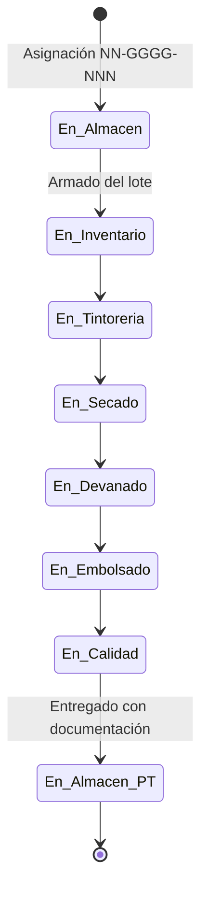

# PRD: Lot Processing — Proceso por Lotes

> **Parte de:** Unidad Operación — Yarn EPR
> **Dependencias:** `docs/prd/operation.md` (PRD de Operación), `docs/prd/warehouse.md` (PRD de Almacén)
> **Documentos relacionados:** `docs/prd/operation/yarn-spinning.md`
> **Siguiente:** `docs/domain/operation/lot-processing.md` (Modelo de Dominio)

---

## 1. Propósito y Alcance

### 1.1 Propósito

Definir el proceso de transformación del hilado consolidado en madejas (proveniente de Yarn Spinning) en Producto Terminado (PT) listo para verificación física, a través de un flujo secuencial de 6 etapas con trazabilidad individual por lote.

### 1.2 Ciclo de vida del lote en el sistema

El lote recorre tres dominios durante su vida en el sistema. Este PRD cubre el tramo de Operación:

```
ALMACÉN                        OPERACIÓN (Lot Processing)               ALMACÉN
   │                                │                                       │
   ├── Asigna NN-GGGG-NNN          │                                       │
   ├── Define: título, color,      │                                       │
   │   cliente, especificaciones   │                                       │
   └── Emite a Operación ─────────►│                                       │
                                   │                                       │
                                   ├── Inventario (arma lote x título/peso)│
                                   ├── Tintorería (aplica color)           │
                                   ├── Secado                              │
                                   ├── Devanado / Ovillado                 │
                                   ├── Embolsado                           │
                                   └── Calidad (clasifica PT)              │
                                        │                                  │
                                        └── Entrega a Almacén ────────────►│
                                      (con documentación de calidad)       │
                                                                            ├── Verificación física
                                                                            └── Disposición según calidad
```

El código `NN-GGGG-NNN` es asignado por Almacén al recibir la MP y es el mismo que identifica al lote durante todo el proceso. Operación no genera códigos de lote nuevos. El sistema es la fuente de toda esta información — cualquier respaldo físico (planilla, etiqueta) es solo una representación impresa de los datos del sistema.

### 1.3 Límites del sistema

| Límite         | Detalle                                                                                                                                                                                                                                                                                                                                                        |
| -------------- | -------------------------------------------------------------------------------------------------------------------------------------------------------------------------------------------------------------------------------------------------------------------------------------------------------------------------------------------------------------- |
| **Entrada**    | MP emitida por Almacén hacia Operación. Almacén define en el sistema el código `NN-GGGG-NNN`, título, color, cliente y especificaciones del pedido. Inventario recibe esa información digitalmente y arma el lote físico a partir de madejas producidas en Madejeras, según el título y peso especificados.                                                    |
| **Salida**     | Lote procesado, inspeccionado por Calidad con su documentación completa, entregado a Almacén para verificación física y disposición.                                                                                                                                                                                                                           |
| **No incluye** | La asignación del código de lote, el enriquecimiento con datos del pedido ni la emisión de MP (documentado en `docs/prd/warehouse.md`). La verificación física final del PT ni su almacenamiento (documentado en `docs/prd/warehouse.md`). La producción de hilado en las 5 secciones de Yarn Spinning (documentado en `docs/prd/operation/yarn-spinning.md`). |

### 1.4 Dependencias

- **Yarn Spinning:** Madejeras consolida el hilado y produce las madejas crudas que Inventario utiliza para armar los lotes. Sin producción en Madejeras no hay lotes.
- **Almacén:** Define el código de lote y las especificaciones del pedido (título, color, cliente) en el sistema. Esa información es la que guía el armado del lote y el proceso productivo.
- **Roles de Operación:** Inventario, Personal de Tintorería, Embolsado y Calidad son los actores que registran datos en el sistema a lo largo del proceso.

---

## 2. Las 6 Etapas del Proceso

Cada lote atraviesa las siguientes etapas en orden secuencial estricto. No se puede registrar una etapa si la anterior no está completada.

El tiempo total del proceso es de aproximadamente 1 a 2 días, pudiendo cruzar múltiples turnos. Cada registro incluye el turno y responsable correspondiente para mantener trazabilidad multi-turno.

### 2.1 Inventario — Armado del lote

El lote ingresa formalmente al sistema. Almacén definió previamente en el sistema el código `NN-GGGG-NNN`, el título, el color, el cliente y las especificaciones del pedido. Inventario consulta esa información, busca en las madejas crudas disponibles (producidas por Madejeras) y arma el lote físico según el **título** y **peso** especificados. El color es competencia de Almacén y Tintorería, no de Inventario.

| Aspecto                     | Descripción                                                                                                                                                                                                                         |
| --------------------------- | ----------------------------------------------------------------------------------------------------------------------------------------------------------------------------------------------------------------------------------- |
| **Quién**                   | Inventario                                                                                                                                                                                                                          |
| **Cuándo**                  | Cuando Almacén emite la MP y hay madejas del título requerido disponibles                                                                                                                                                           |
| **Qué se registra**         | — Código de lote (desde la emisión de Almacén)<br>— Fecha y turno de armado<br>— Responsable que armó el lote<br>— Supervisor a cargo<br>— Título del hilado<br>— Cantidad de madejas que componen el lote<br>— Peso total del lote |
| **Inconvenientes posibles** | — Madejas insuficientes del título requerido<br>— Peso fuera del rango especificado<br>— Datos de emisión incompletos                                                                                                               |
| **Resultado**               | El lote armado pasa a Tintorería                                                                                                                                                                                                    |

### 2.2 Tintorería — Aplicación de color

Las madejas del lote ingresan a las tinas para ser teñidas según el color especificado por Almacén en el sistema.

| Aspecto                     | Descripción                                                                                                                                                                                                                                                              |
| --------------------------- | ------------------------------------------------------------------------------------------------------------------------------------------------------------------------------------------------------------------------------------------------------------------------ |
| **Quién**                   | Personal de Tintorería                                                                                                                                                                                                                                                   |
| **Cuándo**                  | Cuando las madejas ingresan a las tinas                                                                                                                                                                                                                                  |
| **Qué se registra**         | — Fecha y turno de ingreso<br>— Responsable que recibe el lote<br>— Supervisor a cargo<br>— Cantidad de madejas recibidas<br>— Peso neto del lote al ingresar<br>— Número de tina utilizada<br>— Temperatura del proceso<br>— Observaciones categorizadas si corresponde |
| **Inconvenientes posibles** | — Reteñir (color no conforme, requiere un segundo baño)<br>— Temperatura fuera de rango<br>— Tina incorrecta o contaminada<br>— Material (tipo de fibra) no coincide con el proceso                                                                                      |
| **Resultado**               | El lote teñido pasa a Secado                                                                                                                                                                                                                                             |

### 2.3 Secado — Eliminación de humedad

Las madejas teñidas pasan al proceso de secado para eliminar la humedad residual.

| Aspecto                     | Descripción                                                                                                                                                     |
| --------------------------- | --------------------------------------------------------------------------------------------------------------------------------------------------------------- |
| **Quién**                   | Personal de Tintorería                                                                                                                                          |
| **Cuándo**                  | Cuando las madejas salen del proceso de tintorería                                                                                                              |
| **Qué se registra**         | — Fecha y turno de ingreso<br>— Responsable que recibe el lote<br>— Supervisor a cargo<br>— Cantidad de madejas ingresadas<br>— Peso total del lote al ingresar |
| **Inconvenientes posibles** | — Lote no viene de Tintorería (control de secuencia)<br>— Peso inconsistentemente alto (exceso de humedad)                                                      |
| **Resultado**               | El lote seco pasa a Devanado u Ovillado                                                                                                                         |

### 2.4 Devanado / Ovillado — Conversión a formato final

Las madejas secas se convierten al formato final según el destino del producto. Son dos variantes del mismo tipo de proceso:

| Variante     | Destino                          | Producto        |
| ------------ | -------------------------------- | --------------- |
| **Devanado** | Cliente industrial               | Conos de hilado |
| **Ovillado** | Venta directa / Comercialización | Ovillos         |

| Aspecto                     | Descripción                                                                                                                                                                                                       |
| --------------------------- | ----------------------------------------------------------------------------------------------------------------------------------------------------------------------------------------------------------------- |
| **Quién**                   | Inventario (organiza a los operadores de devanado/ovillado)                                                                                                                                                       |
| **Cuándo**                  | Cuando las madejas secas están listas para procesar                                                                                                                                                               |
| **Qué se registra**         | — Fecha y turno de proceso<br>— Responsable que recibe el lote<br>— Supervisor a cargo<br>— Cantidad de madejas procesadas<br>— Cantidad de conos u ovillos producidos<br>— Desperdicio generado en la conversión |
| **Inconvenientes posibles** | — Conos dañados<br>— Título incorrecto<br>— Equipo no calibrado para el título<br>— Desperdicio excesivo                                                                                                          |
| **Resultado**               | El lote en conos u ovillos pasa a Embolsado                                                                                                                                                                       |

### 2.5 Embolsado — Empaque del producto final

Los conos u ovillos se empacan en bolsas con sus etiquetas y fichas correspondientes.

| Aspecto                     | Descripción                                                                                                                                                                                    |
| --------------------------- | ---------------------------------------------------------------------------------------------------------------------------------------------------------------------------------------------- |
| **Quién**                   | Embolsado                                                                                                                                                                                      |
| **Cuándo**                  | Cuando los conos u ovillos están listos para empacar                                                                                                                                           |
| **Qué se registra**         | — Fecha y turno de empaque<br>— Responsable que recibe el lote<br>— Supervisor a cargo<br>— Cantidad de bolsas utilizadas<br>— Cantidad de conos u ovillos por bolsa<br>— Desperdicio generado |
| **Inconvenientes posibles** | — Bolsas dañadas<br>— Etiqueta o ficha incorrecta<br>— Conos dañados detectados al empacar<br>— Cantidad de conos no coincide con lo registrado en Devanado                                    |
| **Resultado**               | El lote empacado pasa a Control de Calidad                                                                                                                                                     |

### 2.6 Calidad — Inspección final y clasificación

Calidad inspecciona el lote completo, verifica parámetros, documenta defectos y asigna la clasificación final del PT, incluyendo nomenclaturas especiales si corresponde. El lote sale de Operación hacia Almacén con su historial completo de calidad.

| Aspecto             | Descripción                                                                                                                                                                                                                                                                                                                                                                                                          |
| ------------------- | -------------------------------------------------------------------------------------------------------------------------------------------------------------------------------------------------------------------------------------------------------------------------------------------------------------------------------------------------------------------------------------------------------------------- |
| **Quién**           | Control de Calidad                                                                                                                                                                                                                                                                                                                                                                                                   |
| **Cuándo**          | Antes de entregar el lote a Almacén                                                                                                                                                                                                                                                                                                                                                                                  |
| **Qué se registra** | — Fecha y turno de inspección<br>— Responsable que inspecciona<br>— Supervisor a cargo<br>— Defectos visuales detectados (doble tono, manchado, varilla, madejas picadas, colas, flames, baja/alta torsión, mezcla)<br>— Defectos internos detectados (purgado, parafinado, ficha, doble cabo, malos amarres, cantidad de amarres, contaminación, etc)<br>— Nomenclatura especial si corresponde<br>— Clasificación final |
| **Resultado**       | El lote sale de Operación hacia Almacén con su documentación completa de calidad                                                                                                                                                                                                                                                                                                                                     |

---

## 3. Inconvenientes y Documentación

### 3.1 Observaciones categorizadas

Cada etapa puede reportar inconvenientes mediante un conjunto predefinido de categorías. Esto permite filtrar, reportar y analizar problemas sin recurrir a texto libre ambiguo.

La categoría se selecciona de un listado específico para cada etapa. Si no aplica ninguna, simplemente no se selecciona.

| Etapa                 | Categorías de inconveniente                                                                                                                                                           |
| --------------------- | ------------------------------------------------------------------------------------------------------------------------------------------------------------------------------------- |
| **Inventario**        | Madejas insuficientes del título requerido / Peso fuera de rango / Datos de emisión incompletos                                                                                       |
| **Tintorería**        | Reteñir (color no conforme) / Temperatura fuera de rango / Tina contaminada / Material incorrecto                                                                                     |
| **Secado**            | Peso fuera de rango / Humedad excesiva                                                                                                                                                |
| **Devanado/Ovillado** | Conos dañados / Título incorrecto / Equipo no calibrado / Desperdicio excesivo                                                                                                        |
| **Embolsado**         | Bolsas dañadas / Etiqueta incorrecta / Conteo no coincide                                                                                                                             |
| **Calidad**           | Doble tono / Manchado / Varilla / Madejas picadas / Colas / Flames / Baja torsión / Alta torsión / Mezcla / Purgado / Parafinado / Ficha / Doble cabo / Malos amarres / Contaminación |

Además de la categoría, se puede incluir un campo opcional de **detalles** en texto libre para contexto adicional (ej: "la tina T-03 presentó residuos del lote anterior").

### 3.2 Registro de timeline

Cada etapa captura el momento en que el lote **entra** y el momento en que **sale**, junto con quién lo recibió y quién lo entregó. Esto permite:

- Saber exactamente cuánto tiempo estuvo el lote en cada etapa
- Identificar cuellos de botella (etapas donde los lotes pasan más tiempo del esperado)
- Determinar quién fue responsable en cada momento, incluso cuando el lote cruza múltiples turnos

El lote avanza cuando **físicamente** cambia de etapa. No hay estados intermedios — si el lote está en Tintorería esperando una decisión sobre un reteñir, sigue estando en Tintorería hasta que sale a Secado.

---

## 4. Ciclo de Vida y Estados del Lote

### 4.1 Diagrama de estados



### 4.2 Estados

| Estado            | Significado                                                                                     |
| ----------------- | ----------------------------------------------------------------------------------------------- |
| **En_Almacen**    | Lote registrado por Almacén, con código NN-GGGG-NNN asignado. Pendiente de emisión a Operación. |
| **En_Inventario** | Lote armado por Inventario, primer registro en el sistema de Operación.                         |
| **En_Tintoreria** | Lote en proceso de teñido.                                                                      |
| **En_Secado**     | Lote en proceso de secado.                                                                      |
| **En_Devanado**   | Lote en proceso de devanado u ovillado.                                                         |
| **En_Embolsado**  | Lote en proceso de empaque.                                                                     |
| **En_Calidad**    | Lote en inspección final.                                                                       |
| **En_Almacen_PT** | Lote entregado a Almacén con su documentación completa de calidad.                              |

### 4.3 Reglas de transición

1. **Secuencial obligatorio:** No se puede registrar una etapa si el lote no completó la anterior. Para registrar en Devanado, el estado actual debe ser `En_Secado`.
2. **Sin retroceso:** Una vez que el lote avanza a la siguiente etapa, no se retrocede. El lote siempre sigue adelante en el flujo.
3. **Inmutabilidad:** Una vez que el lote avanza a la siguiente etapa, los datos de la etapa anterior no se modifican. Si se requiere documentar información adicional, se registra como una nueva observación asociada a esa etapa. El dato original permanece visible.
4. **Entrega a Almacén obligatoria:** Todo lote que completa las 6 etapas sale de Operación hacia Almacén con su documentación completa, independientemente de los defectos registrados.

### 4.4 Clasificación de Calidad

Calidad clasifica el estado final del lote. Esta clasificación documenta la calidad del PT que recibe Almacén y es la base para que Almacén decida su disposición (stock normal, venta con descuento, etc.). El lote siempre se entrega a Almacén, independientemente de su clasificación.

| Clasificación         | Significado                                                                                     | Ejemplo de uso                                                                |
| --------------------- | ----------------------------------------------------------------------------------------------- | ----------------------------------------------------------------------------- |
| **Estándar**          | PT sin defectos o con defectos menores dentro de tolerancia                                     | Lote que cumple especificaciones                                              |
| **Con nomenclatura**  | PT con características especiales que modifican su clasificación o valor                        | -AT (alta torsión), -FT (fuera de tabla), -VARR (con varilla), -D (degradado) |
| **Con observaciones** | PT con defectos documentados que no impiden su uso pero afectan su calidad percibida            | Doble tono leve, manchado superficial, conos con pequeñas imperfecciones      |
| **Rechazado**         | PT con defectos significativos que impiden su comercialización como producto de primera calidad | Contaminación, mezcla irreversible, defectos estructurales                    |

---

## 5. Reglas de Negocio

### 5.1 Trazabilidad multi-turno

El proceso completo del lote puede durar entre 1 y 2 días, cruzando múltiples turnos. Cada registro de etapa captura:

- El turno en que se recibió el lote en esa etapa
- El responsable que lo recibió
- El supervisor a cargo en ese turno
- El turno en que salió de la etapa
- El responsable que lo entregó

Esto garantiza que en cualquier momento se pueda responder: ¿quién hizo qué, en qué turno, y cuánto tiempo estuvo el lote en cada etapa?

### 5.2 Peso por etapa

El peso del lote se mide al inicio de cada etapa para calcular la merma acumulada. La diferencia entre etapas consecutivas revela pérdidas de material durante el proceso.

### 5.3 Inmutabilidad

Los registros de cada etapa (fechas, responsables, datos técnicos) son inmutables una vez que el lote avanza. Si se requiere corregir información, se registra una observación que referencia al registro original. El dato original permanece visible.

### 5.4 Validación antes de avanzar

Antes de registrar una etapa, el sistema verifica:

- Que el lote existe y tiene un código `NN-GGGG-NNN` válido
- Que la etapa anterior está completada
- Que los datos obligatorios están presentes (turno, supervisor, responsable, peso/cantidad)

### 5.5 Cierre del ciclo del lote en Operación

El ciclo del lote en Operación se cierra cuando Calidad completa su inspección y el lote es entregado a Almacén. A partir de ese momento, Almacén recibe el lote con su documentación completa de calidad y decide su disposición (almacenamiento como PT estándar, venta con descuento, reproceso externo, etc.). Esa decisión ya corresponde al dominio de Almacén, no al de Operación.

---

## 6. Visibilidad por Rol

Cada rol ve la información necesaria para su trabajo, más la etapa inmediatamente anterior para validar consistencia. Calidad ve el historial completo del lote.

| Rol                          | Ve sus datos          | Ve (lectura)                                     |
| ---------------------------- | --------------------- | ------------------------------------------------ |
| **Inventario**               | Inventario (armado)   | Información de Almacén: código, título, cliente  |
| **Personal de Tintorería**   | Tintorería, Secado    | Inventario: madejas, peso total                  |
| **Inventario (en Devanado)** | Devanado/Ovillado     | Secado: madejas, peso total                      |
| **Embolsado**                | Embolsado             | Devanado/Ovillado: conos, desperdicio            |
| **Calidad**                  | Calidad               | **Historial completo:** todas las etapas previas |
| **Supervisor**               | Todas (solo lectura)  | Todas (solo lectura). No registra, supervisa.    |
| **Jefe de Producción**       | Dashboard consolidado | Todas las etapas de todos los lotes activos      |
| **Almacén**                  | Sus movimientos       | Datos productivos del lote (solo lectura)        |

---

## 7. Glosario

| Término                       | Definición                                                                                                                                |
| ----------------------------- | ----------------------------------------------------------------------------------------------------------------------------------------- |
| **Lote**                      | Conjunto de madejas que comparten título, color y cliente, identificado por el código `NN-GGGG-NNN`                                       |
| **Código de lote**            | Formato `NN-GGGG-NNN` asignado por Almacén al recibir la MP                                                                               |
| **Especificaciones del lote** | Información definida por Almacén en el sistema: código `NN-GGGG-NNN`, título, color, cliente y datos del pedido                           |
| **Armado de lote**            | Proceso por el cual Inventario selecciona madejas crudas producidas en Madejeras para formar un lote según el título y peso especificados |
| **Clasificación de calidad**  | Categoría asignada por Calidad al PT (estándar, con nomenclatura, con observaciones, rechazado) que documenta su estado                   |
| **Nomenclatura**              | Designación especial asignada por Calidad al PT (-AT, -FT, -VARR, -D) que modifica su clasificación                                       |
| **Merma**                     | Diferencia de peso entre etapas consecutivas que revela pérdida de material                                                               |
| **Devanado**                  | Conversión de madejas en conos (formato para cliente industrial)                                                                          |
| **Ovillado**                  | Conversión de madejas en ovillos (formato para venta directa)                                                                             |
